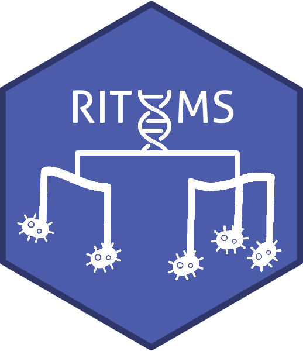
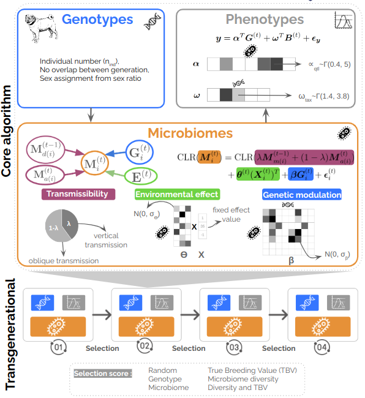

<!-- README.md is generated from README.Rmd. Please edit that file -->

```{r, include = FALSE}
knitr::opts_chunk$set(
  collapse = TRUE,
  comment = "#>",
  fig.path = "man/figures/README-",
  out.width = "100%"
)
```

# RITHMS  

<!-- badges: start -->
Our framework, **R** **I**mplementation of a **T**ransgenerational **H**ologenomic **M**odel-based **S**imulator (RITHMS) is an open-source package, builds upon the MoBPS package and incorporates the distinctive architecture of the microbiota, notably vertical and horizontal transfer as well as modulation due to the environment and host genetics. In addition, RITHMS can account for a variety of selection strategies, is adaptable to different genetic architectures.
<!-- badges: end -->

Full documentation website on: https://SolenePety.github.io/RITHMS  
Last code version on: https://github.com/SolenePety/RITHMS

Here is a little summary of how RITHMS work, but you can read the [preprint](https://arxiv.org/abs/2502.07366) for more details. 



## Installation

You can install the development version of RITHMS from GitHub using `devtools` with:

```{r install, eval=FALSE}
# install.packages("devtools")
devtools::install_github("SolenePety/RITHMS")
```
  
## Toy dataset  
  
You already have a toy dataset, a subset from [Déru et al. 2020](https://pmc.ncbi.nlm.nih.gov/articles/PMC7538339/), there are **1845 species** and **780 individuals**, that show you the expected structure of input data : 
  
```{r data}
library(RITHMS)
datafile <- system.file("DeruPop.rds", package = "RITHMS")
ToyData <- readRDS(datafile)
```
  

## To go further

If you're interested into reproducing the figures of the article you can take a look at [this vignette](https://solenepety.github.io/RITHMS/articles/generate-figures.html#fine-selection-of-h2_d-b2-and-selection-schemes) to generate the figures coming from the article 


