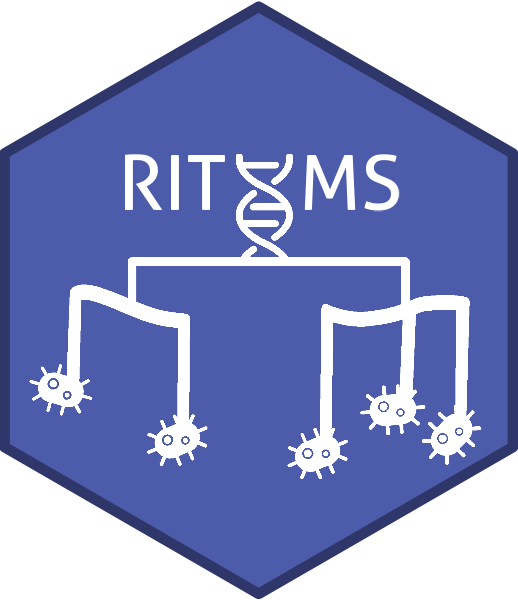

<!-- README.md is generated from README.Rmd. Please edit that file -->

# RITHMS 

<!-- badges: start -->

Our framework, R Implementation of a Transgenerational Hologenomic
Model-based Simulator (RITHMS) is an open-source package, builds upon
the MoBPS package and incorporates the distinctive architecture of the
microbiota, notably vertical and horizontal transfer as well as
modulation due to the environment and host genetics. In addition, RITHMS
can account for a variety of selection strategies, is adaptable to
different genetic architectures. <!-- badges: end -->

Full documentation website on: <https://SolenePety.github.io/RITHMS>  
Last code version on: <https://github.com/SolenePety/RITHMS>

Here is a little summary of how RITHMS work, but you can read the
[preprint](https://hal.science/hal-04913329) for more details.


## Installation

You can install the development version of RITHMS from GitHub using
`devtools` with:

``` r
# install.packages("devtools")
devtools::install_github("SolenePety/RITHMS")
```

## Example

This is a basic example which shows you how to solve a common problem:

``` r
library(RITHMS)
```

You already have a toy dataset, a subset from [Déru et
al. 2020](https://pmc.ncbi.nlm.nih.gov/articles/PMC7538339/), there are
**1845 species** and **780 individuals**, that show you the expected
structure of input data :

``` r
datafile <- system.file("DeruPop.rds", package = "RITHMS")
ToyData <- readRDS(datafile)
```

But we can do much more… you can check also [this
vignette](https://solenepety.github.io/RITHMS/articles/generate-figures.html#fine-selection-of-h2_d-b2-and-selection-schemes)
to generate the figures coming from the article
