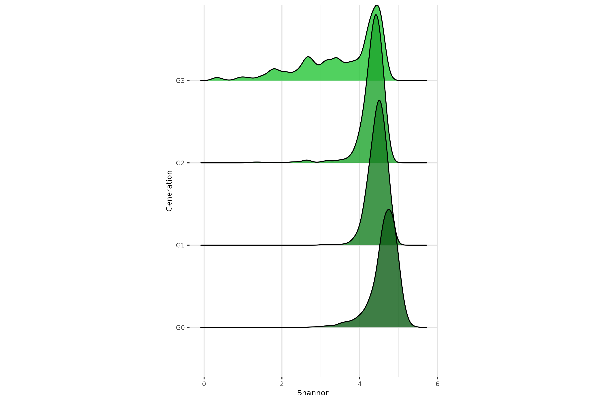
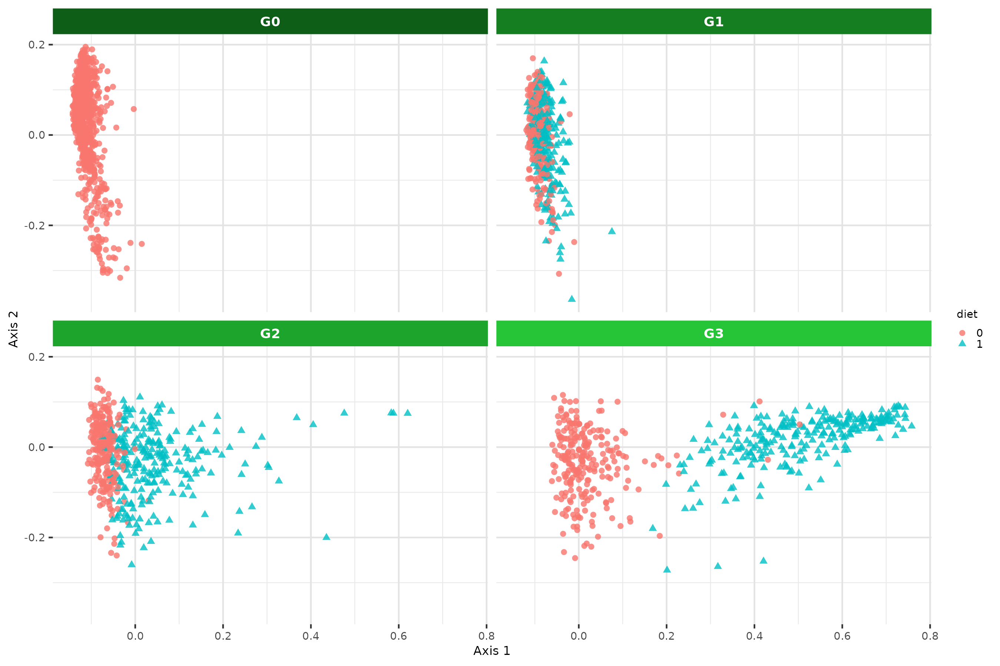

# Generate figures

``` r
library(RITHMS)
```

In this vignette, we explore a large number of simulation scenarios to
illustrate the capabilities and features of RITHMS. These results were
obtained on the dataset described below. Further explanations are given
in [the article](https://arxiv.org/abs/2502.07366). RITHMS can account
for a variety of **selection strategies** and is adaptable to different
genetic architectures. We found that simulated data accurately preserved
key characteristics **across generations**, notably **microbial
diversity metrics**, exhibited the expected behavior in terms and
**correlation** between taxa and of modulation of **vertical and
horizontal transmission**, response to **environmental effects** and the
evolution of **phenotypic values** depending on selection strategy.

``` r
library(magrittr)
library(MoBPS)
library(ComplexHeatmap)
library(circlize)
library(cowplot)
library(tidyverse)
library(ggrepel)
library(ggridges)
library(phyloseq)
library(ggh4x)
library(ggplot2)
library(peakRAM)
library(glue)
library(BGLR)
```

To visualise changes over generations, we will use a green gradient :

``` r
greens_pal <- c("#6df17c","#2ede41","#26c537","#1da42c","#157e21","#0E5e17")
```

General theme parameters for plots :

``` r
session_theme <- theme_minimal() + theme(panel.border = element_rect(colour= "white", fill = NA),
                                               panel.grid.major = element_line(colour = "#e3e3e3"),
                                               panel.grid.minor = element_line(colour = "#e9e9e9"),
                                               axis.title = element_text(size = 8),
                                               axis.text = element_text(size=7),
                                               plot.title = element_text(size = 12),
                                               legend.title = element_text(size = 7),
                                               legend.text = element_text(size = 7),
                                               legend.position = "none")
theme_set(session_theme)
```

## **Load data**

The data matrix loaded is the count matrix of taxa (in columns) across
individuals (in rows). In our toy dataset, a subset from [Déru et
al. 2020](https://pmc.ncbi.nlm.nih.gov/articles/PMC7538339/), there are
**1845 species** and **780 individuals** coming from the conventional
diet. Genotypes are encoded as 0,1,2 and reachable thanks to
*“population”* attribute.

``` r
data("Deru")
founder_object <- Deru
founder_object$microbiome[1:5,1:5]
#>   OTU1 OTU2 OTU6793 OTU3 OTU4
#> 1   30  593       4  630  414
#> 2  254  275      62 1131  446
#> 3  181  487     164 1472  656
#> 4  469  665      45  640  328
#> 5  771  519      21  758  347
```

``` r
#MoBPS population structure, use get.geno() and generation index to extract genotypes
genotypes <- founder_object$population %>%
  get.geno(gen=1)

genotypes[1:5,1:5]
#>      M1_1 M2_1 M3_1 M4_1 M5_1
#> SNP1    2    2    1    1    2
#> SNP2    1    1    1    1    1
#> SNP3    2    2    2    2    2
#> SNP4    2    2    2    2    2
#> SNP5    2    2    1    1    2
```

## **Simulation reflects structure of microbiome**

This section matches code of **Figure 3** of the paper.

### **Produce intra- and inter-cluster (anti)correlations**

Through $\beta$ matrix, its values and the overlapping of QTL, we’re
able to induce correlations between taxa.

For this example, **4%** of the taxa are under genetic control. The
pairwise correlation matrix of taxa abundances are represented here.
Taxa are sorted based on the cluster they belong to.

``` r
taxa_assign_g_small <- assign_taxa(founder_object, 
                                   taxa_g = 0.04)

# Output is the assignation of each taxa to a cluster, 0 corresponds to taxa that are not under genetic control
taxa_assign_g_small[taxa_assign_g_small !=0 ]
#>  [1] 1 1 1 2 1 1 2 1 3 4 3 4 3 2 2 2 4 3 2 5 2 2 2 4 3 3 2 3 4 3 3 1 6 6 1 6 4 4
#> [39] 6 1 5 5 1 5 4 4 1 5 3 3 4 2 6 4 6 5 5 4 6 6 6 2 3 5 1 5 5 5 5 5 6 6 4 4 4 5
#> [77] 4 3 6
#> Levels: 0 1 2 3 4 5 6
```

Once you have these elements you’re able to call
[`holo_simu()`](../reference/holo_simu.md).

``` r
noise = 0.6 #noise of the microbiome
effect.size = 0.3 #genetic effect size
lambda = 0.5 #same weight for vertical and horizontal transmission
dir = T #dirichlet sampling for ambient microbiome

generations_simu <- holo_simu(h2 = 0.25, #direct heritability
                              b2 = 0.25, #microbiability
                              founder_object = founder_object,
                              n_clust = taxa_assign_g_small,
                              n_ind = 500, #per generation
                              verbose = F, 
                              noise.microbiome = noise,
                              effect.size = effect.size,
                              lambda = lambda,
                              dir = dir,
                              selection = F, #30% males and females sampled for next generation
                              seed = 333)
```

The $\beta$ matrix is reachable through metadata of
[`holo_simu()`](../reference/holo_simu.md) output.

``` r
#Correlation intra-cluster for cluster under genetic control
beta <- generations_simu$metadata$Beta_matrix$matrix[taxa_assign_g_small != 0,]
cor_matrix <- cor(t(beta))
taxa_order <- taxa_assign_g_small[taxa_assign_g_small != 0] %>% order()
cor_matrix <- cor_matrix[taxa_order,taxa_order]
```

Then we’re able to build our Heatmap using
[ComplexHeatmap](https://jokergoo.github.io/ComplexHeatmap-reference/book/)

``` r
pal <- colorRampPalette(RColorBrewer::brewer.pal(5,"Set1"))(length(taxa_assign_g_small[taxa_assign_g_small != 0] %>% unique()))
clus_col <- structure(pal, names = taxa_assign_g_small[taxa_assign_g_small != 0] %>% unique() %>% as.vector())

leftAnn = rowAnnotation(clust = taxa_assign_g_small[taxa_assign_g_small != 0] %>% sort(),
                        col = list(clust = clus_col),
                        show_annotation_name = F,
                        annotation_legend_param = list(clust = list(title = "Cluster ID",title_gp = gpar(fontsize = 5, fontface = "bold"), labels_gp = gpar(fontsize = 5, fontface = 'bold'))))
colAnn = HeatmapAnnotation(clust = taxa_assign_g_small[taxa_assign_g_small != 0] %>% sort(),
                        col = list(clust = clus_col),
                        show_annotation_name = F,
                        show_legend = FALSE)

col_fun = colorRamp2(c(min(cor_matrix), 0, max(cor_matrix)), c("blue", "white", "red"))

p1 <- grid.grabExpr(draw(Heatmap(cor_matrix, 
        cluster_rows = F, 
        cluster_columns = F, 
        show_row_names = F, 
        show_column_names = F,
        left_annotation = leftAnn,
        top_annotation = colAnn,
        col = col_fun,
        heatmap_legend_param = list(title = "Correlation", title_gp = gpar(fontsize = 5, fontface = "bold"), labels_gp = gpar(fontsize = 5, fontface = 'bold')))))

plot_grid(p1)
```


### **Modulate relative importance of vertical and horizontal transmission**

The composition of the microbiota of individuals are given by this
equation :
$\lambda\mathbf{M}_{d{(i)}}^{(t - 1)} + (1 - \lambda)\mathbf{M}_{a{(i)}}^{(t)}$.
Given this, $\lambda = 0$ corresponds to no vertical transmission. We’re
looking here at the correlations between offspring α-diversity (from G2)
and that of its mother (purple), father (orange) or ambient microbiota
(green) for increasing values of λ.

``` r
set.seed(484)

#Change n_it to increase the accuracy of the function, n_it = 10 used in the article
n_it = 1
seed_value <- sample(c(100:9999),n_it)

params_df_it <- tibble::tibble(lambda = c(0,0.5,1)) %>%
  crossing(tibble(seed = seed_value)) %>% 
  mutate(sim_ID = row_number(), .before = "lambda")
```

We perform the taxa assignation for all this small study.

``` r
taxa_assign_g <- assign_taxa(founder_object)
```

Then we have the following function that can be call in parallel for all
the different scnarios in this test.

``` r
noise = 0.1
effect.size = 0.1
center_bg = T
dir = T

#Boxplot lambda vs diversity correlation with offspring
  
run_simulation_lambda <- function(i, it) {
      generations_simu <- holo_simu(h2 = 0.25,
                                    b2 = 0.25,
                                    founder_object = founder_object,
                                    n_clust = taxa_assign_g,
                                    n_ind = 500,
                                    verbose = F,
                                    noise.microbiome = noise,
                                    effect.size = effect.size,
                                    lambda = as.numeric(params_df_it[i,"lambda"]),
                                    dir = dir,
                                    selection = F,
                                    seed = as.numeric(params_df_it[i,"seed"]))
      
      #Richness of G2 offsprings
      current_div <- generations_simu$G2$microbiome %>% 
        richness_from_abundances_gen(size_rmultinom = generations_simu$parameters$size_rmultinom)
      
      #Richness of offpsring's fathers
      previous_s_div <- sapply(generations_simu$G2$pedigree[,"father"],
                               function(x){generations_simu$G1$microbiome[,x]}) %>% 
        richness_from_abundances_gen(size_rmultinom = generations_simu$parameters$size_rmultinom)
      
      #Richness of offpsring's mothers
      previous_d_div <- sapply(generations_simu$G2$pedigree[,"mother"],
                               function(x){generations_simu$G1$microbiome[,x]}) %>% 
        richness_from_abundances_gen(size_rmultinom = generations_simu$parameters$size_rmultinom)
      
      #Richness of ambient microbiome
      ambient_div <- generations_simu$G2$mean_microbiome %>% 
        richness_from_abundances_gen(size_rmultinom = generations_simu$parameters$size_rmultinom)
      
      
      tibble(lambda = list(as.numeric(params_df_it[i,"lambda"])),
             Mother = list(cor(current_div$Shannon,previous_d_div$Shannon)),
             Father = list(cor(current_div$Shannon,previous_s_div$Shannon)),
             Ambient = list(cor(current_div$Shannon,ambient_div$Shannon))
      )
  } 
```

If you want to parallelize the code, you could use `plan(multisession)`.

``` r
plan(sequential)
results <- future_map_dfr(
  seq_len(nrow(params_df_it)),
  function(i) {
    map_dfr(seq_len(n_it), ~ run_simulation_lambda(i, .x))
  }
)
plan(sequential)
```

The useful information of these simulations are the microbiomes, the
pedigree and the ambient microbiome that could be extracted for each
generation. We’re focusing on G2 here.

``` r
long_cor_gen <- results %>% 
  mutate(lambda = unlist(lambda),
         Mother = unlist(Mother),
         Father = unlist(Father),
         Ambient = unlist(Ambient)) %>%
  pivot_longer(c("Mother","Father","Ambient"),
               names_to = "cor_type",
               values_to = "value")
```

``` r
lambda_label <- cbind(x = c(0,0.5,1),
                      y = c(0.8,0.2,0.8),
                      label = c("Ambient","Father","Mother")) %>% as.data.frame()
lambda_label$y <- as.numeric(lambda_label$y)

p3 <- long_cor_gen %>% summarise(value = mean(value), .by = c(lambda, cor_type)) |> ggplot(aes(x=as.factor(lambda),y=value,col=cor_type, group = cor_type)) +
  geom_line() +
  geom_point( alpha=0.8)  +
  geom_text_repel(data = lambda_label,
                  aes(x = x, y = y, label = label, color = label, group = NULL),
        direction = "y",
        show.legend = FALSE) +
  theme(legend.key.size = unit(0.25, 'cm')) +
  ylab("Correlation value") +
  xlab("Lambda") +
  labs(col = "Parents") +
  guides(shape = "none") +
  ylim(-0.2,1) +
  scale_y_continuous(
    breaks = seq(0,1,0.25),
    labels = seq(0,1,0.25)
  ) +
  scale_color_brewer(palette = "Dark2")

p3
```


### **Achieve a target distribution of taxa heritabilities**

The function `calibrate_gen_effect()` is intended to guide the user in
choosing an appropriate effect size to achieve a target distribution of
taxa heritabilities. Build-in plots are in the function but we’ve used
the output of the function in order to make a density plot of the
distribution of taxa heritability for increasing genetic effect sizes
($\sigma_{\beta} \times \sqrt{\text{QTL}_{\text{o}}}$), shown above each
curve.

``` r
out_data <- gen_effect_calibration(founder_object = founder_object,
                                   taxa_assign_g = taxa_assign_g,
                                   correlation = 0.5,
                                   effect.size = c(0.3,0.6,1),
                                   plot = F)
```

``` r
# Calculate density peaks
density_peaks <- out_data %>%
  group_by(effect.size) %>%
  summarise(
    peak = density(Heritability)$y[which.max(density(Heritability)$y)],
    peak_x = density(Heritability)$x[which.max(density(Heritability)$y)]
  )

  p2 <- out_data %>% ggplot(aes(x=Heritability,fill=as.factor(effect.size), label = as.factor(effect.size))) +
      geom_density(alpha=0.8, color = NA)+
      geom_text_repel(
        data = density_peaks,
        aes(x = peak_x, y = peak, label = effect.size, color = as.factor(effect.size)),
        nudge_x = 0.02,
        nudge_y = 0.3,
        direction = "y",
        show.legend = FALSE) +
      labs(x = "Taxa heritability",
           y = "Density",
           fill = "Genetic effect size")+
      theme(panel.background = element_rect(fill="white"),
            panel.grid.major = element_line(colour="#e3e3e3"),
            panel.grid.minor = element_line(colour="#e9e9e9"),
            axis.title = element_text(size = 8),
            axis.text = element_text(size=7),
            plot.title = element_text(size=7),
            legend.position = "none") +
    scale_fill_manual(values = c("#00AFBB", "#E7B800", "#FC4E07")) +
    scale_color_manual(values = c("#00AFBB", "#E7B800", "#FC4E07"))
 p2
```

### **Alpha-diversity remains stable across generations**

In a neutral framework, without selection of environmental effect, we
expect the $\alpha$-diversity to be stable across generations. From
[`holo_simu()`](../reference/holo_simu.md) output, the relative
abundances of taxa, $\alpha$-diversity indexes thanks to multinomial
sampling in
[`richness_from_abundances_gen()`](../reference/richness_from_abundances_gen.md)
function.

``` r
h2 = 0.25
b2 = 0.25
generations_simu <- holo_simu(h2 = h2,
                              b2 = b2,
                              founder_object = founder_object,
                              n_clust = taxa_assign_g,
                              n_ind = 500,
                              verbose = F,
                              noise.microbiome = noise,
                              effect.size = effect.size,
                              lambda = 0.5,
                              dir = dir,
                              selection = F,
                              seed = 8082)
```

``` r
diversities_microbiomes <- generations_simu[-c(1,2)] %>% map(get_microbiomes) %>%
  map(richness_from_abundances_gen, size_rmultinom = generations_simu$parameters$size_rmultinom) |>
  bind_rows(.id = "Generation")
  
p4 <- ggplot(diversities_microbiomes,aes(x=Shannon,y=Generation,fill=Generation)) +
        geom_density_ridges(alpha=0.8) + 
        theme(aspect.ratio = 1.5)+
  scale_fill_manual(values = rev(greens_pal))
  
p4
```

``` r
ggsave("../man/figures/ridges_shannon.png", p4, width = 9, height = 6)
```


## **Introduction of transient perturbations of the microbiota**

In breeding and selection programs, it is essential to account for fixed
environmental effects, given their strong role in modulating an
individual’s phenotype. It is therefore important to verify that
simulated transgenerational hologenomic data can correctly integrate
such factors under a variety of plausible scenarios, such as short-term
treatments or long-term diet effects.

To build this modulation, the user build outside the main function the
$\theta X$ product and choose precisely the values and the effect size
given to each environmental effect. Dimensions of this product should
match the `founder_object$microbiome` ones.

To evaluate our simulation on that part we’ve computed a
multidimensional scaling (MDS) of microbial abundance data using
Bray-Curtis distances and ridges plot of Shannon index values.

This section matches code of **Figure 4** of the paper.

### **Sporadic environmental effect**

Half the individuals at G1 are subject to a sporadic antibiotic
treatment which affects all taxa.

``` r
#Construction of environmental effect before simulating the population
h2 = 0.25
b2 = 0.25
noise = 0.6
effect.size = 0.3
dir= T
n_ind = 500
lambda = 0.5

set.seed(42)
antibio <- rep(0, n_ind)
antibio_ind <- sample(1:n_ind, 250) #selecting index of individuals
antibio[antibio_ind] <- 1 
X <- matrix(antibio, ncol = n_ind, nrow = 1)

theta <- rnorm(ncol(founder_object$microbiome),mean = 0, sd = 5) #sampling strong antibiotics effect
theta <- ifelse(theta > 0, -theta, theta) %>% matrix(ncol = 1, nrow = ncol(founder_object$microbiome)) #only negative values for all taxa

thetaX <- theta %*% X
```

``` r
generations_simu_env <- holo_simu(h2 = h2,
                                  b2 = b2,
                                  founder_object = founder_object,
                                  n_clust = taxa_assign_g,
                                  n_ind = n_ind,
                                  verbose = F,
                                  noise.microbiome = noise,
                                  effect.size = effect.size,
                                  lambda = lambda,
                                  dir = dir,
                                  selection = F,
                                  seed = 30,
                                  thetaX = thetaX,
                                  env_gen = c(T,F,F,F,F)) #on the five generations asked, we apply thetaX only on G1, not considering G0
```

#### **Diversity on antibiotic effect**

Call to [`get_microbiomes()`](../reference/get_microbiomes.md) and
[`richness_from_abundances_gen()`](../reference/richness_from_abundances_gen.md)
to extract all useful metrics.

``` r
diversities_microbiomes <- generations_simu[-c(1,2)] %>% map(get_microbiomes) %>%
  map(richness_from_abundances_gen, size_rmultinom = generations_simu$parameters$size_rmultinom) |>
  bind_rows(.id = "Generation")

  p1 <- diversities_microbiomes %>% filter(!Generation %in% c("G4","G5")) %>%
    ggplot(aes(x=Shannon,y=Generation,fill=Generation)) +
    geom_density_ridges(alpha=0.8) + 
    theme(aspect.ratio = 1.5)+
    scale_fill_manual(values = rev(greens_pal)[1:4])
  
  p1
```


#### **MDS on antibiotic effect**

``` r
microbiomes_all <- generations_simu_env[c(3,4,5,6)] %>% map(get_microbiomes, transpose = T, CLR = F) |> bind_rows(.id = "Generation")
                          
antibio_vec <- rep(0, nrow(microbiomes_all))
id_antibio_ind <- rownames(microbiomes_all)[which(microbiomes_all$Generation == "G1")] %in% colnames((generations_simu_env$G1$microbiome))[which(X != 0)]
antibio_vec[which(microbiomes_all$Generation == "G1")[id_antibio_ind]] <- 1
metadata <- cbind(Generation = microbiomes_all$Generation, ID = rownames(microbiomes_all), antibio = antibio_vec) |> as.data.frame()
rownames(metadata) <- metadata$ID
```

Call to [vegan
package](https://cran.r-project.org/web/packages/vegan/vignettes/intro-vegan.pdf)
to compute Bray Curtis distance matrix.

``` r
dist_mat <- vegan::vegdist(x = microbiomes_all[-1],
                 method = "bray")
```

Call to [phyloseq package](https://joey711.github.io/phyloseq/) to
manipulate efficiently and compute MDS with
[`ordinate()`](https://rdrr.io/pkg/phyloseq/man/ordinate.html) function.

``` r
physeq <- phyloseq(
  otu_table(t(microbiomes_all[,-1]), taxa_are_rows = TRUE),
  sample_data(metadata))

ord <- ordinate(physeq, method = "MDS", distance = dist_mat)

DF <- plot_ordination(physeq, ord, justDF = T)
```

``` r
p2 <- ggplot(data = DF, aes(x=DF[,1], y=DF[,2], color = antibio, shape=antibio)) + 
    labs(x = "Axis 1",
         y = "Axis 2") +
  geom_point(alpha = 0.8) + 
  theme(legend.key.size = unit(0.25, 'cm'),
        strip.text = element_text(color = "white", face = "bold")) +
  facet_wrap2(~Generation, nrow = 2, ncol = 2, strip = strip_themed(background_x = elem_list_rect(fill = rev(greens_pal)[1:4])))

p2
```


### **Sustained environmental effet**

Starting from G1, half the individuals at each generation (blue
triangles) are subject to a diet favoring two clusters of taxa.

``` r
h2 = 0.25
b2 = 0.25
noise = 0.6
effect.size = 0.3
dir= T
center_bg = T
n_ind = 500
lambda = 0.5

set.seed(56)
# Xi <- small portions of individuals
diet <- rep(0, n_ind)
diet_ind <- sample(1:n_ind, 250)
diet[diet_ind] <- 1 
X <- matrix(diet, ncol = n_ind, nrow = 1)

theta <- rep(0, length(taxa_assign_g))
cluster_diet <- table(taxa_assign_g)[table(taxa_assign_g) > 10 & table(taxa_assign_g) < 30] %>% sample(3) %>% names() %>% as.numeric() #sample of clusters modulated by diet
theta[taxa_assign_g %in% cluster_diet] <- rnorm(sum(taxa_assign_g %in% cluster_diet ),mean = 0, sd = 2)
theta <- ifelse(theta < 0, -theta, theta) %>% matrix(ncol = 1, nrow = length(taxa_assign_g))#Only positive values for all taxa

thetaX <- theta %*% X
```

``` r
generations_simu_env <- holo_simu(h2 = h2,
                              b2 = b2,
                              founder_object = founder_object,
                              n_clust = taxa_assign_g,
                              n_ind = n_ind,
                              verbose = F,
                              noise.microbiome = noise,
                              effect.size = effect.size,
                              lambda = lambda,
                              dir = dir,
                              selection = F,
                              seed = 3042,
                              thetaX = thetaX,
                              env_gen = c(T,T,T,T,T)) #Applied on all generations 
```

#### **Diversity on diet effect**

``` r
diversities_microbiomes <- generations_simu_env[c(3,4,5,6)] %>% map(get_microbiomes) %>%
  map(richness_from_abundances_gen, size_rmultinom = generations_simu$parameters$size_rmultinom) |> 
  bind_rows(.id = "Generation")

  p4 <- ggplot(diversities_microbiomes,aes(x=Shannon,y=Generation,fill=Generation)) +
        geom_density_ridges(alpha=0.8) + 
        theme(aspect.ratio = 1.5)+
        scale_fill_manual(values = rev(greens_pal)[1:4])
p4
```



#### **MDS on diet effect**

``` r
#Post-processing of the data
microbiomes_all <- generations_simu_env[c(3,4,5,6)] %>% map(get_microbiomes, transpose = T, CLR = F) |> bind_rows(.id = "Generation")

diet_vec <- rep(0, nrow(microbiomes_all))
diet_vec[which(microbiomes_all$Generation == "G1")[diet_ind]] <- 1
diet_vec[which(microbiomes_all$Generation == "G2")[diet_ind]] <- 1
diet_vec[which(microbiomes_all$Generation == "G3")[diet_ind]] <- 1
diet_vec[which(microbiomes_all$Generation == "G4")[diet_ind]] <- 1
diet_vec[which(microbiomes_all$Generation == "G5")[diet_ind]] <- 1

metadata <- cbind(Generation = microbiomes_all$Generation, ID = rownames(microbiomes_all), diet = diet_vec) |> as.data.frame()
rownames(metadata) <- metadata$ID
```

``` r
dist_mat <- vegan::vegdist(x = microbiomes_all[-1],
                 method = "bray")
```

``` r
physeq <- phyloseq(
  otu_table(t(microbiomes_all[,-1]), taxa_are_rows = TRUE),
  sample_data(metadata))

ord <- ordinate(physeq, method = "MDS", distance = dist_mat)
```

``` r
DF <- plot_ordination(physeq, ord, justDF = T)
p3 <- ggplot(data = DF, aes(x=DF[,1], y=DF[,2], color = diet, shape=diet)) + 
    labs(x = "Axis 1",
         y = "Axis 2") +
  geom_point(alpha = 0.8) + 
  theme(legend.key.size = unit(0.25, 'cm'),
        strip.text = element_text(color = "white", face = "bold")) +
  facet_wrap2(~Generation, nrow = 2, ncol = 2, strip = strip_themed(background_x = elem_list_rect(fill = rev(greens_pal)[1:4]))) +
  scale_fill_manual(values = rev(greens_pal)[1:4])
p3
```



## **Fine selection of direct heritability, microbiability and selection schemes**

In the absence of selection, we want to verify that the target values
are reached and maintained across generations and then observe trends in
phenotypic improvement as a function of four different selection
strategies.

All the computation for both plots in this section are performed at the
same time, the barplot is a subset of the facet grid.

This section matches code of **Figure 5** of the paper.

### **Target values of direct heritability and microbiability are reached and maintained**

``` r
# n_it = 50 was used to generate the figures of the article
n_it = 1
set.seed(42)
vec_seed <- sample(100:10000,n_it)
```

``` r
noise = 0.6
effect.size = 0.3
lambda = 0.1
dir = T
  
#For the exemple, not all values were computed, you can uncomment all the lines to obtain the complete figure.
params_df_it <- tibble::tribble(
  ~h2,  ~b2,
#  0.05, 0.05,
#  0.25, 0.05,
#  0.4,  0.05,
 # 0.05, 0.25,
  0.25, 0.25,
  0.4,  0.25,
#  0.05, 0.4,
 0.25, 0.4,
  0.4,  0.4
  ) |> crossing(tibble(`Selection Type` = c("GB", "G", "B", "None")),tibble(seed = vec_seed)) |> 
  mutate(sim_ID = row_number(), .before = "h2")
params_df <- tibble::tribble(
  ~h2,  ~b2,
 # 0.05, 0.05,
 # 0.25, 0.05,
#  0.4,  0.05,
 # 0.05, 0.25,
  0.25, 0.25,
  0.4,  0.25,
#  0.05, 0.4,
  0.25, 0.4,
  0.4,  0.4
) |> 
  crossing(tibble(`Selection Type` = c("GB", "G", "B", "Random"))) |> 
  mutate(sim_ID = row_number(), .before = "h2")
```

``` r
run_simulation <- function(i, it) {
  start_time_it <- Sys.time()
  
  ram_result <- peakRAM({
    taxa_assign_g <- assign_taxa(founder_object)
    selection = if (params_df$`Selection Type`[i] == "Random") FALSE else TRUE
    generations_simu <- holo_simu(
      h2 = params_df$h2[i],
      b2 = params_df$b2[i],
      founder_object = founder_object,
      n_clust = taxa_assign_g,
      n_ind = 500,
      verbose = FALSE,
      noise.microbiome = noise,
      effect.size = effect.size,
      lambda = lambda,
      dir = dir,
      selection = selection,
      size_selection_F = if (selection == "FALSE") NULL else 0.3,
      size_selection_M = if (selection == "FALSE") NULL else 0.3,
      selection_type = if (params_df$`Selection Type`[i] == "Random") NULL else params_df$`Selection Type`[i],
      seed = vec_seed[it]
    )
  })
  
  gc() #clean memory
  
  phenotypes_all <- generations_simu[-c(1,2)] %>% map(get_phenotypes) |> bind_rows(.id = "Generation")
  
  tibble(mean_phenotypes = list(generations_simu[-c(1,2)] %>% 
                                  map(get_mean_phenotypes)),
         metric_values = list(phenotypes_all %>% 
                                group_by(Generation) %>% 
                                summarise(h2 = var(gq)/var(y), 
                                          b2 = var(gb)/var(y), 
                                          e2 = 1 - var(gq)/var(y) - var(gb)/var(y)))
  )
}
```

If you want to parallelize the code, you could use `plan(multisession)`.

``` r
plan(sequential)
results <- future_map_dfr(
  seq_len(nrow(params_df)),
  function(i) {
    map_dfr(seq_len(n_it), ~ run_simulation(i, .x))
  }
)
plan(sequential)
```

``` r
metrics_values <- results %>% 
  bind_cols(params_df_it) %>% 
  filter(h2 == 0.25,b2 == 0.25) %>% #for barplot, gather only results for h2 = b2 = 0.25
  select(metric_values) %>% 
  unnest_wider(metric_values) %>% 
  unnest_longer(c(Generation,h2,b2,e2)) %>% 
  group_by(Generation) %>% 
  summarize(h2 = mean(h2), b2 = mean(b2), e2=mean(e2)) %>% 
  pivot_longer(cols = c(h2, b2, e2), names_to = "Metric", values_to = "Value")

metrics_values$Metric <- factor(metrics_values$Metric, levels = c("e2","b2","h2"))
```

``` r
colours <- setNames(c("#ce0104", "#0237AE", "#808080"), 
                    c("b2", "h2", "e2"))

p2 <- metrics_values |> ggplot(aes(x=Generation, y = Value, fill = Metric))+
  geom_bar(stat = "identity") + 
  ylab("Value") +
  theme(axis.text.y = element_text(vjust = seq(0, 1, length.out = 5)))+
  geom_hline(yintercept = 0.25, col="white", linetype = 2) + 
  annotate("text", x = 3, y= 0.125, label=expression(bold(h[d]^2)), color = "white", size = 4) + 
  geom_hline(yintercept = 0.5, col="white", linetype = 2) + 
  annotate("text", x = 3, y= 0.375, label=expression(bold(b^2)), color = "white", size = 4) + 
  annotate("text", x = 3, y= 0.75, label=expression(bold(e^2)), color = "white", size = 4) + 
  scale_y_continuous(expand = expansion(0, 0)) + 
  scale_fill_manual(values = colours)
p2
```


### **Mean phenotype change across generations according to selection strategy**

``` r
mean_phenotypes <- results %>% 
  select(mean_phenotypes) %>% 
  bind_cols(params_df_it) %>% 
  unnest_wider(mean_phenotypes)

phenotypes_longer <- mean_phenotypes %>% 
  pivot_longer(cols = matches("^G"), values_to = "Y mean", names_to = "Generation") %>% 
  summarise("Y sd"   = sd(`Y mean`), 
            "Y mean" = mean(`Y mean`),
            .by = c(`Selection Type`, Generation, h2, b2)) |> 
  mutate("Y mean" = `Y mean` - `Y mean`[Generation == "G0"], .by = c(`Selection Type`, h2, b2))

phenotypes_longer$`Selection Type` <- ifelse(phenotypes_longer$`Selection Type` == "GB","TBV", phenotypes_longer$`Selection Type`)

colours <- c(
  B = "#ce0104", 
  G = "#0237AE", 
  TBV = "#8123d9", 
  None = "black"
)

custom_labeller <- labeller(
  b2 = as_labeller(function(x) paste0("b^2 == ", x), label_parsed),
  h2 = as_labeller(function(x) paste0("h[d]^2 == ", x), label_parsed)
)

labels <- phenotypes_longer |> 
  filter(h2 == 0.25, b2 == 0.25, Generation == "G5") |> 
  mutate(
    label = recode(`Selection Type`,
                   B = "BV[m]",
                   G = "BV[d]",
                   TBV = "BV[t]",
                   None = "Random"))
```

``` r
p1 <- phenotypes_longer |> 
  ggplot(aes(x = Generation, y = `Y mean`, group = `Selection Type`, color = `Selection Type`)) + 
  geom_point(size = 0.5) + 
  geom_line(alpha = 0.5)  +
  geom_smooth(method = "lm", se = TRUE, linetype = 0, aes(fill = `Selection Type`), alpha = 0.2)+
  geom_text_repel(data = labels, 
            aes(label = label), parse = T, hjust = -1, vjust = -0.8, direction = "y", segment.color = "grey80") + 
  labs(y = "Mean phenotype change") +
  theme(panel.grid.major = element_line(colour="#e3e3e3"),
        panel.grid.minor.y = element_blank(),
        panel.grid.major.x = element_blank(), 
        panel.grid.minor.x = element_blank(), 
        strip.text = element_text(size=12))  +
  facet_grid(rows = vars(h2), 
             cols = vars(b2), 
             drop = TRUE, 
             labeller = custom_labeller,
             switch = "y") +
  scale_y_continuous(position = "right") +
  scale_color_manual(values = colours) +
  scale_fill_manual(values = colours) +
  coord_cartesian(clip = "off")
p1
```

 For the selection criteria
we have :  
- Red line = Selection on microbiota breeding values,  
- Blue line = Selection on direct breeding values,  
- Purple line = Selection on total breeding values,  
- Black line = Random selection

## **Selection index based on a combination of trait and diversity metrics**

As a first demonstration of the usefulness of RITHMS, we consider a
practical case study of complex breeding program with a multi-trait
objective: maximizing phenotypic change while perserving microbial
$\alpha$-diversity.

This section matches code of **Figure 6** of the paper.

``` r
#n_it = 25 was used to generate the figure of the article
n_it = 1
set.seed(40)
vec_seed <- sample(100:10000,n_it)
```

``` r
params_df <- tibble::tribble(
   ~div,  ~TBV,
   0,    1,
   1,    0,
   0.5, 0.5,
   0.8, 0.2,
   0.2, 0.8,
   0.7, 0.3,
   0.3, 0.7,
   0.4, 0.6,
   0.6, 0.4,
   0.1, 0.9,
   0.9, 0.1
  ) |> crossing(tibble(seed = vec_seed)) |> 
  mutate(sim_ID = row_number(), .before = "div") %>% 
  mutate(concatenated = glue("({div},{TBV})"))

noise = 0.6
effect.size = 0.3
lambda = 0.5
```

For each iteration, we look at the diversity and the phenotype values.

``` r
run_simulation_study <- function(i, it) {

  set.seed(as.numeric(params_df[i,4]))
  taxa_assign_g <- assign_taxa(founder_object)
  
  generations_simu <- holo_simu(h2 = 0.25,
                                b2 = 0.25,
                                founder_object = founder_object,
                                n_clust = taxa_assign_g,
                                n_ind = 500,
                                verbose = F,
                                noise.microbiome = noise,
                                effect.size = effect.size,
                                lambda = lambda,
                                selection = T,
                                dir = T,
                                size_selection_F = 0.3,
                                size_selection_M = 0.3,
                                selection_type = "div.GB",
                                w.param = c(as.numeric(params_df[i,2]), as.numeric(params_df[i,3])),
                                seed = as.numeric(params_df[i,4]))
  
  tibble(mean_phenotypes_y = list(generations_simu[-c(1,2)] %>% 
                                    map(get_mean_phenotypes) %>% 
                                    bind_rows(.id = "Generation")),
         diversities_microbiomes = list(generations_simu[-c(1,2)] %>%
                                          map(get_microbiomes) %>% 
                                          map(richness_from_abundances_gen, size_rmultinom = generations_simu$parameters$size_rmultinom) |> 
                                          map(get_mean_diversity) %>% 
                                          bind_rows(.id = "Generation"))
         )
  
}
```

If you want to parallelize the code, you could use `plan(multisession)`.

``` r
plan(sequential)
results <- future_map_dfr(
  seq_len(nrow(params_df)),
  function(i) {
    map_dfr(seq_len(n_it), ~ run_simulation_study(i, .x))
  }
)
plan(sequential)
```

We look at the differences for our two traits between the base
population and the last generation but it could be any generation.

``` r
mean_phenotypes_y <- results$mean_phenotypes_y %>% bind_rows()
diversities_microbiomes <- results$diversities_microbiomes %>% bind_rows()
```

``` r
diff_y <- mean_phenotypes_y$G5 - mean_phenotypes_y$G0
diff_div <- diversities_microbiomes$G5 - diversities_microbiomes$G0

diff_data <- tibble(diff_y = diff_y,
                    diff_div = diff_div,
                    category = params_df$concatenated)

diff_data_concat <- diff_data %>% summarise(mean_div = mean(diff_div), 
                                            mean_y = mean(diff_y), 
                                            sd_div = (1.96 * sd(diff_div)/sqrt(n())),
                                            sd_y = (1.96 * sd(diff_y)/sqrt(n())),
                                            .by = c(category))
```

``` r
p <- diff_data %>%
  mutate(w = str_remove_all(category, "\\(|,.*") |> as.numeric()) |> 
  ggplot(aes(y = diff_y, x = diff_div, 
             colour = w
             )) +
  geom_point(alpha = 0.4, shape = 20, size = 3) +
  geom_point(data = diff_data_concat |> mutate(w = str_remove_all(category, "\\(|,.*") |> as.numeric()), 
             aes(y = mean_y, x = mean_div), 
             shape = 15, size = 5) +
  geom_line(data = diff_data_concat |>  mutate(w = str_remove_all(category, "\\(|,.*") |> as.numeric()), 
            aes(y = mean_y, x = mean_div, group = 1), show.legend = FALSE) +
  geom_vline(xintercept = 0, linetype = 2, color = "darkgrey") +
  geom_hline(yintercept = 0, linetype = 2, color = "darkgrey") + 
  theme(legend.key.size = unit(0.3, 'cm'),
    legend.title = element_text(size = 12, face = "bold"), 
    legend.text = element_text(size = 10),
    legend.position = "inside",
    legend.position.inside = c(0.49, 0.02),
    legend.justification.inside = c(0.5, 0), 
    legend.direction = "horizontal",
    legend.box = "horizontal",
  ) +
  labs(
    y = "Mean phenotype change (over 5 generations)",
    x = "Microbial diversity change (over 5 generations)",
    colour = expression(w[div])
  ) + 
  scale_color_viridis_c(option = "D", 
                        breaks = seq(0,1,0.1),
                        name = expression(w[div]),
                        labels = seq(0,1,0.1)) +
  coord_cartesian(clip = "off") +
  theme(legend.key.width = unit(25, "mm"),
        legend.background = element_rect(fill = "transparent")) +
  NULL

p
```


## **Impact of data subsampling on variance component estimation**

To illustrate another possible use of RITHMS, we conducted a study of
the estimation of variance components under different data availability
scenarios. Such a study is of particular interest to evaluate the impact
of different sampling strategies, for example to account for financial
or experimental constraints. First, we simulated a population of 2500
hologenotyped and phenotyped individuals over 5% with generations, with
$\lambda = 0.5$. Then we estimated the direct heritability ($h_{d}^{2}$)
and microbiability ($b^{2}$) with a GMBLUP model using the [R
package](https://pmc.ncbi.nlm.nih.gov/articles/PMC4196607/) and linear
scaled kernels of genotypes and microbiota, based on various subsets of
individuals: (a) the full dataset (2500 individuals), (b) a random
subset of 30% of individuals (750 individuals), (c) only breeding
parents (750 individuals), and (d) only mothers (375 individuals). The
following figure shows the distribution of the estimated variance
components across 500 independent iterations for each subset.

### **Additional functions**

Several functions have been written to compute this study case.

#### **Build linear kernels**

``` r
get_genotypes <- function(data, transpose = F) {
  if(transpose){
    return(data |> pluck("genotypes") |> t() |> as.data.frame())
  }
  return(data |> pluck("genotypes") |> as.data.frame())
}
```

``` r
build_kernel_G <- function(gen_simu,
                           mask_ind = F,
                           mask_crit = "random",
                           mask_size = 0.3){
  #####
  # ID of individuals to be included in the kernels
  #####
  ind_id <- gen_simu[-c(1,2,3)] %>% map(get_microbiomes) %>% map(colnames) %>% unlist(.,use.names = F)
  if(mask_ind){
    if(mask_crit == "random"){
      ind_omics <- ind_id %>% sample(., round(length(.)*mask_size))
    }else{
      id_selected <- gen_simu[-c(1,2,3)] %>% map(get_selected_ind)
      if(mask_crit == "female"){
        ind_omics <- id_selected %>% map(function(x){
          split(x, str_extract(x, "^[FM]"))$F
        }) %>% unlist() 
      }else{
        ind_omics <- id_selected %>% unlist(.,use.names = F)
      }
    }
  }else{
    ind_omics <- ind_id
  }
  
  #####
  # Extract genotypes
  #####
  G_long <- gen_simu[-c(1,2,3)] %>% map(get_genotypes, transpose = T) %>% bind_rows()
  G_long <- G_long[ind_omics,]
  
  #View(G_long)
  G_scaled <- scale(G_long[, apply(G_long, 2, var) > 0])
  s <- ncol(G_scaled)
  K <- tcrossprod(G_scaled)/s
  
  # Store the hologenotyped individuals
  attr(K,"omics") <- ind_omics
  return(K)
}
```

``` r
process_microbiome <- function(agg_microbiome){
  B <- lapply(agg_microbiome, as.data.frame)
  B_full <- B %>% bind_rows(.id = "Generation")
  B <- B_full[,-1]
  return(B)
}
```

``` r
build_kernel_M <- function(gen_simu,
                           ind_omics){
  #####
  # Extract microbiomes
  #####
  B_long <- gen_simu[-c(1,2,3)] %>% map(get_microbiomes, transpose = T, CLR = T)
  
  M_join <- process_microbiome(B_long)[ind_omics,]
  M_scaled <- base::scale(as.matrix(M_join))
  p <- ncol(M_scaled)
  K <- tcrossprod(M_scaled)/p
  return(K)
}
```

#### **Call to BGLR**

``` r
run_BGLR <- function(G, M = NULL, yNA, index) {
  set.seed(Sys.time())
  ETA <- list()
  ETA[["genotype"]] = list(K = G, model = "RKHS", scale = FALSE)
  if(!is.null(M)){
    ETA[["microbiota"]] = list(K = M, model = "RKHS", scale = FALSE)
  }
  fm <- BGLR(y = yNA, ETA = ETA, nIter = 3000, burnIn = 1000, saveAt = "RKHS_",verbose=FALSE)
  return(list(
    coeffMHat = if (is.null(M)) NULL else fm[["ETA"]][["microbiota"]][["u"]],
    coeffGHat = fm[["ETA"]][["genotype"]][["u"]],
    varM = if (is.null(M)) NULL else mean(scan("RKHS_ETA_microbiota_varU.dat", quiet = TRUE)),
    varG = mean(scan("RKHS_ETA_genotype_varU.dat", quiet = TRUE)),
    varE = mean(scan('RKHS_varE.dat',quiet = T)),
    yHat = fm$yHat[index]
  ))
}
```

#### **Call to RITHMS and result extraction**

``` r
MBLUP_kernel <- function(gen_simu,
                         MBLUP = FALSE,
                         mask_ind = F,
                         mask_crit = "random",
                         mask_size = 0.3){
  
  last_gen <- tail(names(gen_simu),n=1)
  
  G <- build_kernel_G(gen_simu = gen_simu,
                    mask_ind = mask_ind,
                    mask_crit = mask_crit,
                    mask_size = mask_size)
  
  if(MBLUP){
    M <- build_kernel_M(gen_simu = gen_simu,
                      ind_omics = attr(G,"omics")) 
  }else{
    M = NULL
  }
  
  #####
  # Extract phenotypes and remove G5 (without G0)
  #####
  Y <- gen_simu[-c(1,2,3)] %>% map(get_phenotypes) |> bind_rows(.id = "Generation")
  Y <- Y[Y$ID %in% attr(G,"omics"),]
  yNA <- Y$y
  G5_index <- which(Y$Generation == last_gen)
  yNA[G5_index] <- NA
  
  #####
  # Fits the (M)G-BLUP model on aggregated and random one
  #####
  results_std <- run_BGLR(G = G, M = M, yNA = yNA, index = G5_index)
  
  #####
  # Output
  #####
  return(tibble(
    coeffMHat = list(results_std$coeffMHat),
    coeffGHat = list(results_std$coeffGHat),
    varM = list(results_std$varM),
    varG = list(results_std$varG),
    varE = list(results_std$varE),
    gb = list(Y$gb),
    gq = list(Y$gq),
    real_y = list(Y$y[G5_index]),
    yHat = list(results_std$yHat),
    ind_omics = list(attr(G,"omics"))
  ))
}
```

``` r
run_simulation <- function(sim_ID, effect.size, h2, b2, seed, lambda, log_file, mask_ind = F, mask_crit = "random", mask_size = 0.3) {

     taxa_assign_g <- assign_taxa(founder_object)
  
     generations_simu <- holo_simu(
       h2 = h2, 
       b2 = b2, 
       correlation = 0.5, 
       n_gen = 5,
       founder_object = founder_object,
       n_clust = taxa_assign_g, 
       selection = T,
       size_selection_F = 0.3,
       size_selection_M = 0.3,
       selection_type = "G",
       n_ind = 500, 
       verbose = FALSE,
       noise.microbiome = 0.6, 
       effect.size = effect.size,
       lambda = lambda,
       seed = seed
     )
    
    MGBLUP_results <- MBLUP_kernel(generations_simu, 
                                   MBLUP = TRUE,
                                   mask_ind = mask_ind,
                                   mask_crit = mask_crit,
                                   mask_size = mask_size)
    
    MGBLUP_results_full <- MGBLUP_results %>%
      mutate(sim_ID = list(sim_ID),
             nb_otug = list(length(generations_simu$metadata$otu_list)),
             omega = list(generations_simu$metadata$B_coeff),
             alpha = list(generations_simu$metadata$G_coeff))
    gc()
    
  return(MGBLUP_results_full)
}
```

### **Simulation parameters**

For the article, 500 iterations were performed.

``` r
n_it <- 5
set.seed(200)

mask_tbl <- tibble(
  mask_ind  = c(FALSE, TRUE, TRUE, TRUE, TRUE),
  mask_crit = c(NA, "random", "random", "parents", "female"),
  mask_size = c(NA, 0.5, 0.3, NA, NA)
)

params_df_full <- mask_tbl %>%
  crossing(tibble(b2 = 0.25),
           tibble(effect.size = 0.3),
           tibble(h2 = 0.25),
           tibble(lambda = c(0.5)),
           tibble(replicate = 1:n_it)) %>%
  dplyr::mutate(sim_ID = row_number(),
         seed = sample(100:100000, n()),
         .before = everything())

params_blocks <- params_df_full %>%
  group_by(mask_crit, replicate) %>%
  group_split()
```

``` r
results_demo <- params_blocks %>%
  purrr::map_dfr(function(block) {
    block %>%
      dplyr::rowwise() %>%
      dplyr::mutate(res = list(
        run_simulation(
          sim_ID      = sim_ID,
          effect.size = effect.size,
          h2          = h2,
          b2          = b2,
          seed        = seed,
          lambda      = lambda,
          mask_ind    = mask_ind,
          mask_crit   = mask_crit,
          mask_size   = mask_size
        )  %>% 
      dplyr::rename(sim_ID_res = sim_ID)
      )) %>%
      dplyr::ungroup() %>%
      tidyr::unnest(res)
  })
```

### **Graphical section**

``` r
df_join <- results_demo %>% mutate(varM = unlist(varM),
                                   varG = unlist(varG),
                                   varE = unlist(varE),
                                   b2_hat = varM / (varE + varM + varG),
                                   h2_hat = varG / (varE + varM + varG),
                                   scenario = glue("{mask_ind}_{mask_crit}_{mask_size}")) %>% 
  pivot_longer(c(b2_hat,h2_hat), values_to = "Estimate",names_to = "Metric") %>%
  mutate(scenario = factor(
    scenario,
    levels = c("FALSE_NA_NA", "TRUE_random_0.5", "TRUE_random_0.3", "TRUE_parents_NA", "TRUE_female_NA"),
    labels = c("All individuals", "50% random", "30% random", "Parents only", "Mothers only")
  ))
```

``` r
p <- df_join %>%
  filter(scenario != "50% random") %>% #as in the article
  ggplot(aes(x = as.factor(scenario), y = Estimate)) +
  geom_jitter(aes(fill = "grey20", alpha= 0.3, width = 0.25)) +
  geom_boxplot(fill = "grey20",color = "grey50") +
  geom_abline(intercept = 0.25, slope = 0, linetype = 2, color = "darkred") + 
  theme(panel.background = element_rect(fill="white"),
        panel.grid.major = element_line(colour="#e3e3e3"),
        panel.grid.minor = element_line(colour="#e9e9e9"),
        axis.title = element_text(size = 12),
        axis.text = element_text(size=9),
        plot.title = element_text(size=12),
        strip.background = element_rect(fill = "grey20", color = "grey20", linewidth = 0.5),
        strip.text = element_text(color = "white", face = "bold", size = 10),
        legend.position = "none") +
  labs(x = "(Sub)set used for GMBLUP",
       y = glue("Estimated variance")) + 
  facet_wrap(
    . ~ Metric,
    labeller = as_labeller(c(
      "b2_hat" = "Microbiability",
      "h2_hat" = "Direct Heritability"))
  )

p
```


## **Future work**

It would be interesting to extend the RITHMS model to :  
(i) account for **microbial interactions** with a non-diagonal
covariance matrix for the noise component $\sigma_{m}$ of the taxa
abundances,  
(ii) allow for the inclusion of **more complex environmental
effects**,  
(iii) allow for the **use of semi-complete**, rather than fully paired,
genomic and microbiota data to create the base population, which would
enable RITHMS simulations to be calibrated on a datasets for which some
samples lack genomic or microbiota data,  
(iv) the use of RITHMS to alternative **hologenomic datasets**, notably
for a variety of species and experimental designs, and additional use
cases for the evaluation of complex breeding schemes.

**For any ideas or collaboration relating to the package, feel free to
contact : <solene.pety@inrae.fr>**
