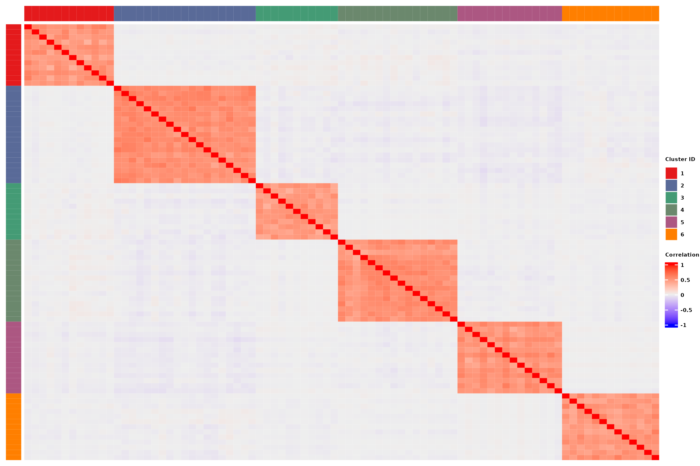
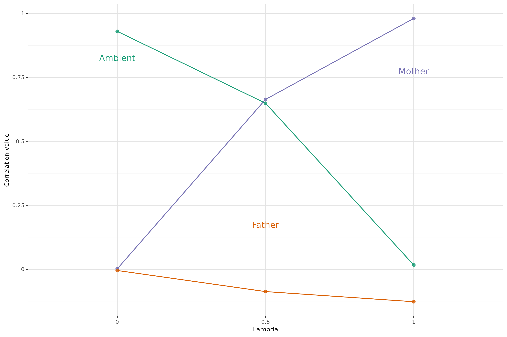
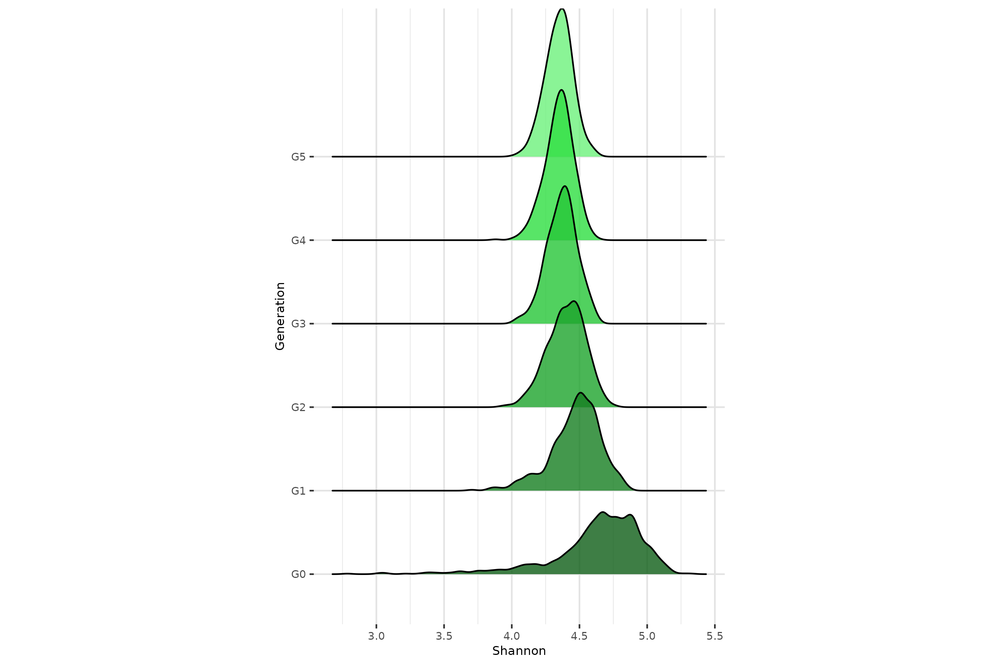
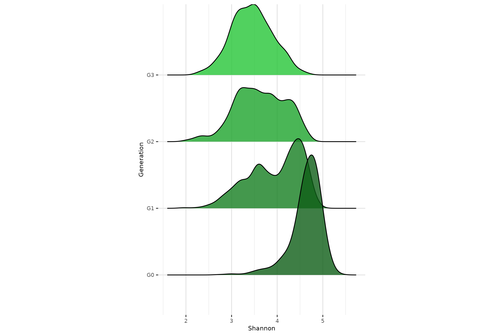
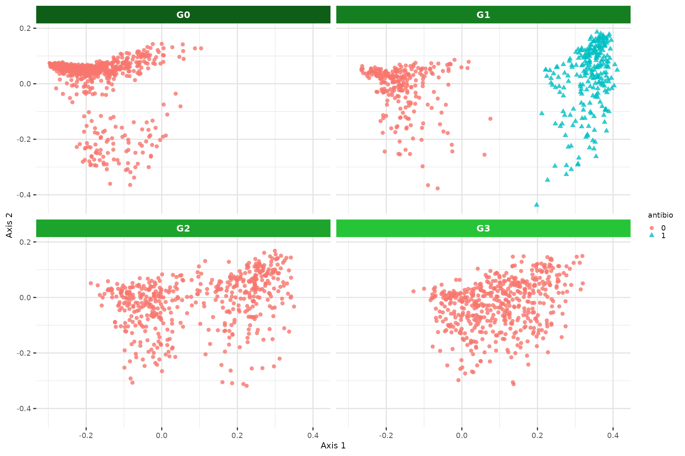
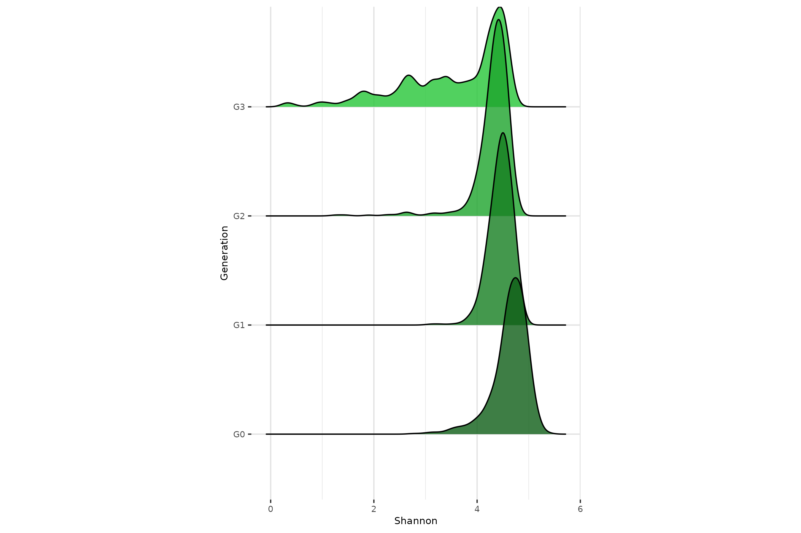
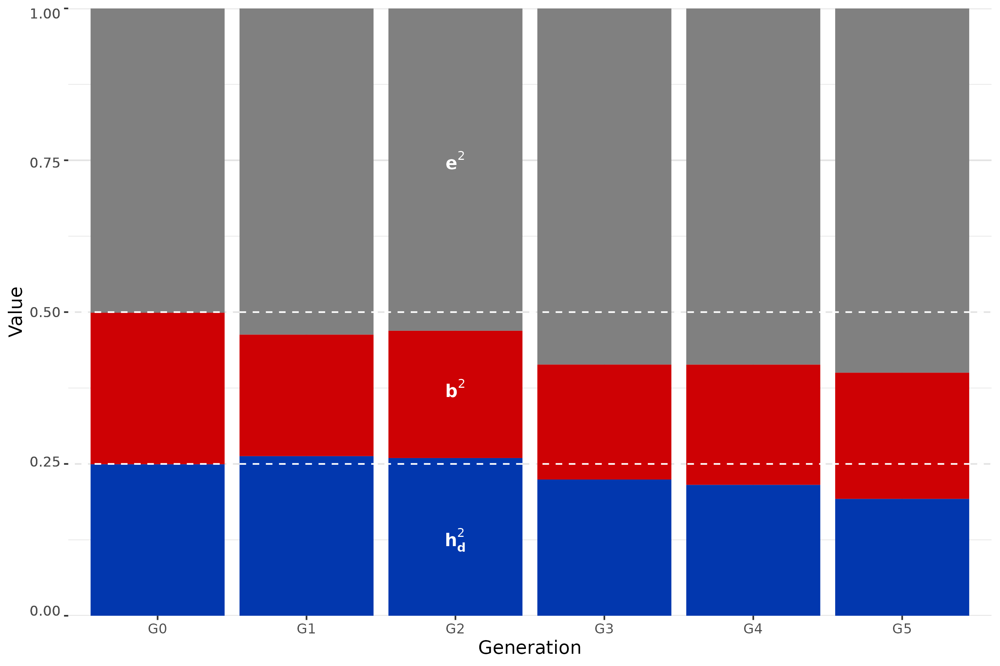
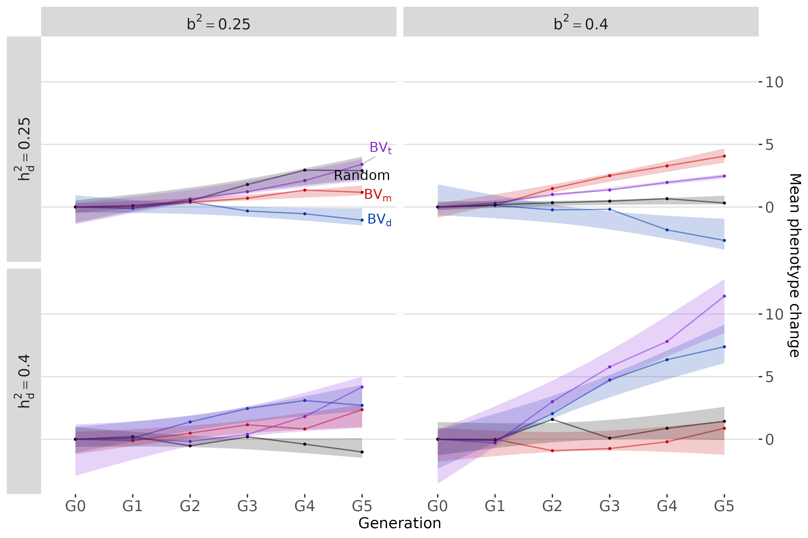
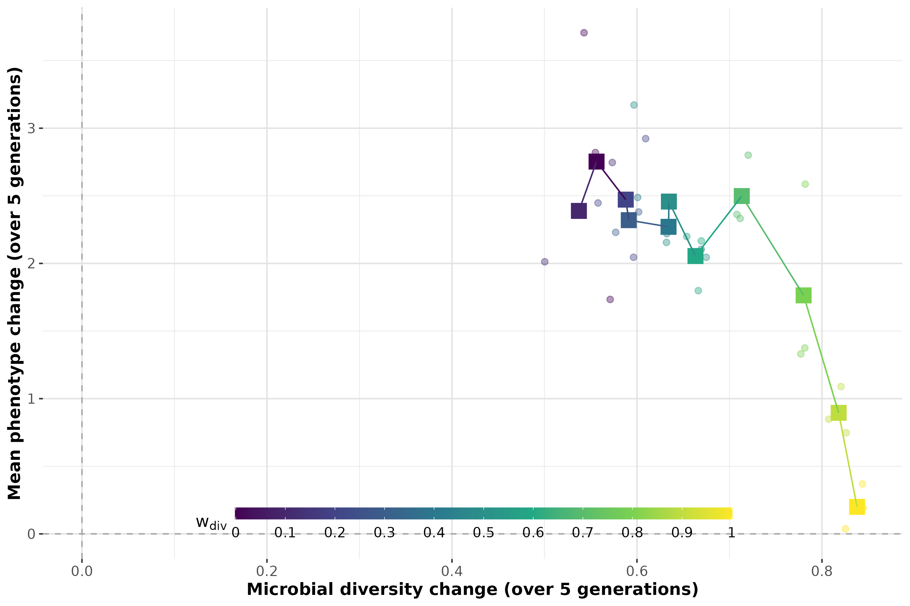

  
In this vignette, we explore a large number of simulation scenarios to illustrate the capabilities and features of RITHMS. These results were obtained on the dataset described below. Further explanations are given in [the article](https://arxiv.org/abs/2502.07366). RITHMS can account for a variety of **selection strategies** and is adaptable to different genetic architectures. We found that simulated data accurately preserved key characteristics **across generations**, notably **microbial diversity metrics**, exhibited the expected behavior in terms and **correlation** between taxa and of modulation of **vertical and horizontal transmission**, response to **environmental effects** and the evolution of **phenotypic values** depending on selection strategy.   
     
```{r setup}
#| echo: no

knitr::opts_chunk$set(message=FALSE,
                      warning=FALSE,
                      echo = TRUE,
                      collapse = TRUE,
                      eval = FALSE,
                      comment = "#>")
```


```{r init}
#| class.source: fold-show
#| eval: yes

library(magrittr)
library(MoBPS)
library(ComplexHeatmap)
library(circlize)
library(cowplot)
library(tidyverse)
library(ggrepel)
library(ggridges)
library(phyloseq)
library(ggh4x)
library(ggplot2)
library(peakRAM)
library(glue)
```


To visualise changes over generations, we will use a green gradient : 
  
```{r}
#| class.source: fold-show

greens_pal <- c("#6df17c","#2ede41","#26c537","#1da42c","#157e21","#0E5e17")
```

General theme parameters for plots :  
  
```{r}
session_theme <- theme_minimal() + theme(panel.border = element_rect(colour= "white", fill = NA),
                                               panel.grid.major = element_line(colour = "#e3e3e3"),
                                               panel.grid.minor = element_line(colour = "#e9e9e9"),
                                               axis.title = element_text(size = 8),
                                               axis.text = element_text(size=7),
                                               plot.title = element_text(size = 12),
                                               legend.title = element_text(size = 7),
                                               legend.text = element_text(size = 7),
                                               legend.position = "none")
theme_set(session_theme)
```
  
# **Load data**
  
The data matrix loaded is the count matrix of taxa (in columns) across individuals (in rows). In our toy dataset, a subset from [Déru et al. 2020](https://pmc.ncbi.nlm.nih.gov/articles/PMC7538339/), there are **1845 species** and **780 individuals** coming from the conventional diet. Genotypes are encoded as 0,1,2 and reachable thanks to *"population"* attribute.
  
```{r}
#| class.source: fold-show
#| eval: yes

data("Deru")
founder_object <- Deru
founder_object$microbiome[1:5,1:5]
```


```{r}
#| class.source: fold-show
#| eval: yes

#MoBPS population structure, use get.geno() and generation index to extract genotypes
genotypes <- founder_object$population %>%
  get.geno(gen=1)

genotypes[1:5,1:5]
```


# **Simulation reflects structure of microbiome**
  
This section matches code of **Figure 3** of the paper.  
  
## **Produce intra- and inter-cluster (anti)correlations**  
  
Through $\beta$ matrix, its values and the overlapping of QTL, we're able to induce correlations between taxa. 
  
For this example, **4%** of the taxa are under genetic control. The pairwise correlation matrix of taxa abundances are represented here. Taxa are sorted based on the cluster they belong to.
  
```{r}
#| class.source: fold-show
#| eval: yes

taxa_assign_g_small <- assign_taxa(founder_object, 
                                   taxa_g = 0.04)

# Output is the assignation of each taxa to a cluster, 0 corresponds to taxa that are not under genetic control
taxa_assign_g_small[taxa_assign_g_small !=0 ]
```


Once you have these elements you're able to call `holo_simu()`.  
  
```{r}
#| class.source: fold-show

noise = 0.6 #noise of the microbiome
effect.size = 0.3 #genetic effect size
lambda = 0.5 #same weight for vertical and horizontal transmission
dir = T #dirichlet sampling for ambient microbiome

generations_simu <- holo_simu(h2 = 0.25, #direct heritability
                              b2 = 0.25, #microbiability
                              founder_object = founder_object,
                              n_clust = taxa_assign_g_small,
                              n_ind = 500, #per generation
                              verbose = F, 
                              noise.microbiome = noise,
                              effect.size = effect.size,
                              lambda = lambda,
                              dir = dir,
                              selection = F, #30% males and females sampled for next generation
                              seed = 333)

```


The $\beta$ matrix is reachable through metadata of `holo_simu()` output.   
  
```{r}
#| class.source: fold-hide

#Correlation intra-cluster for cluster under genetic control
beta <- generations_simu$metadata$Beta_matrix$matrix[taxa_assign_g_small != 0,]
cor_matrix <- cor(t(beta))
taxa_order <- taxa_assign_g_small[taxa_assign_g_small != 0] %>% order()
cor_matrix <- cor_matrix[taxa_order,taxa_order]
```


Then we're able to build our Heatmap using [ComplexHeatmap](https://jokergoo.github.io/ComplexHeatmap-reference/book/)  
  
```{r}
#| class.source: fold-hide

pal <- colorRampPalette(RColorBrewer::brewer.pal(5,"Set1"))(length(taxa_assign_g_small[taxa_assign_g_small != 0] %>% unique()))
clus_col <- structure(pal, names = taxa_assign_g_small[taxa_assign_g_small != 0] %>% unique() %>% as.vector())

leftAnn = rowAnnotation(clust = taxa_assign_g_small[taxa_assign_g_small != 0] %>% sort(),
                        col = list(clust = clus_col),
                        show_annotation_name = F,
                        annotation_legend_param = list(clust = list(title = "Cluster ID",title_gp = gpar(fontsize = 5, fontface = "bold"), labels_gp = gpar(fontsize = 5, fontface = 'bold'))))
colAnn = HeatmapAnnotation(clust = taxa_assign_g_small[taxa_assign_g_small != 0] %>% sort(),
                        col = list(clust = clus_col),
                        show_annotation_name = F,
                        show_legend = FALSE)

col_fun = colorRamp2(c(min(cor_matrix), 0, max(cor_matrix)), c("blue", "white", "red"))

p1 <- grid.grabExpr(draw(Heatmap(cor_matrix, 
        cluster_rows = F, 
        cluster_columns = F, 
        show_row_names = F, 
        show_column_names = F,
        left_annotation = leftAnn,
        top_annotation = colAnn,
        col = col_fun,
        heatmap_legend_param = list(title = "Correlation", title_gp = gpar(fontsize = 5, fontface = "bold"), labels_gp = gpar(fontsize = 5, fontface = 'bold')))))

plot_grid(p1)
```


```{r}
#| echo: no

ggsave("../man/figures/Heatmap_correlation.png", p1, width = 9, height = 6)
```


{width=80%}

## **Modulate relative importance of vertical and horizontal transmission**  
  
The composition of the microbiota of individuals are given by this equation : $\lambda \boldsymbol{M}^{(t-1)}_{d(i)} + (1 - \lambda) \boldsymbol{M}^{(t)}_{a(i)}$. Given this, $\lambda = 0$ corresponds to no vertical transmission. We're looking here at the correlations between offspring α-diversity (from G2) and that of its mother (purple), father (orange) or ambient microbiota (green) for increasing values of λ.
```{r}
#| class.source: fold-show

set.seed(484)

#Change n_it to increase the accuracy of the function, n_it = 10 used in the article
n_it = 1
seed_value <- sample(c(100:9999),n_it)

params_df_it <- tibble::tibble(lambda = c(0,0.5,1)) %>%
  crossing(tibble(seed = seed_value)) %>% 
  mutate(sim_ID = row_number(), .before = "lambda")
```

  
We perform the taxa assignation for all this small study.  
  
```{r}
#| class.source: fold-show

taxa_assign_g <- assign_taxa(founder_object)
```


Then we have the following function that can be call in parallel for all the different scnarios in this test.  
  
```{r}
#| class.source: fold-show

noise = 0.1
effect.size = 0.1
center_bg = T
dir = T

#Boxplot lambda vs diversity correlation with offspring
  
run_simulation_lambda <- function(i, it) {
      generations_simu <- holo_simu(h2 = 0.25,
                                    b2 = 0.25,
                                    founder_object = founder_object,
                                    n_clust = taxa_assign_g,
                                    n_ind = 500,
                                    verbose = F,
                                    noise.microbiome = noise,
                                    effect.size = effect.size,
                                    lambda = as.numeric(params_df_it[i,"lambda"]),
                                    dir = dir,
                                    selection = F,
                                    seed = as.numeric(params_df_it[i,"seed"]))
      
      #Richness of G2 offsprings
      current_div <- generations_simu$G2$microbiome %>% 
        richness_from_abundances_gen(size_rmultinom = generations_simu$parameters$size_rmultinom)
      
      #Richness of offpsring's fathers
      previous_s_div <- sapply(generations_simu$G2$pedigree[,"father"],
                               function(x){generations_simu$G1$microbiome[,x]}) %>% 
        richness_from_abundances_gen(size_rmultinom = generations_simu$parameters$size_rmultinom)
      
      #Richness of offpsring's mothers
      previous_d_div <- sapply(generations_simu$G2$pedigree[,"mother"],
                               function(x){generations_simu$G1$microbiome[,x]}) %>% 
        richness_from_abundances_gen(size_rmultinom = generations_simu$parameters$size_rmultinom)
      
      #Richness of ambient microbiome
      ambient_div <- generations_simu$G2$mean_microbiome %>% 
        richness_from_abundances_gen(size_rmultinom = generations_simu$parameters$size_rmultinom)
      
      
      tibble(lambda = list(as.numeric(params_df_it[i,"lambda"])),
             Mother = list(cor(current_div$Shannon,previous_d_div$Shannon)),
             Father = list(cor(current_div$Shannon,previous_s_div$Shannon)),
             Ambient = list(cor(current_div$Shannon,ambient_div$Shannon))
      )
  } 
```

  
If you want to parallelize the code, you could use `plan(multisession)`.  
   
```{r}
#| class.source: fold-show

plan(sequential)
results <- future_map_dfr(
  seq_len(nrow(params_df_it)),
  function(i) {
    map_dfr(seq_len(n_it), ~ run_simulation_lambda(i, .x))
  }
)
plan(sequential)
```

  
The useful information of these simulations are the microbiomes, the pedigree and the ambient microbiome that could be extracted for each generation. We're focusing on G2 here.  
  
```{r}
#| class.source: fold-hide

long_cor_gen <- results %>% 
  mutate(lambda = unlist(lambda),
         Mother = unlist(Mother),
         Father = unlist(Father),
         Ambient = unlist(Ambient)) %>%
  pivot_longer(c("Mother","Father","Ambient"),
               names_to = "cor_type",
               values_to = "value")
```


```{r}
#| class.source: fold-hide

lambda_label <- cbind(x = c(0,0.5,1),
                      y = c(0.8,0.2,0.8),
                      label = c("Ambient","Father","Mother")) %>% as.data.frame()
lambda_label$y <- as.numeric(lambda_label$y)

p3 <- long_cor_gen %>% summarise(value = mean(value), .by = c(lambda, cor_type)) |> ggplot(aes(x=as.factor(lambda),y=value,col=cor_type, group = cor_type)) +
  geom_line() +
  geom_point( alpha=0.8)  +
  geom_text_repel(data = lambda_label,
                  aes(x = x, y = y, label = label, color = label, group = NULL),
        direction = "y",
        show.legend = FALSE) +
  theme(legend.key.size = unit(0.25, 'cm')) +
  ylab("Correlation value") +
  xlab("Lambda") +
  labs(col = "Parents") +
  guides(shape = "none") +
  ylim(-0.2,1) +
  scale_y_continuous(
    breaks = seq(0,1,0.25),
    labels = seq(0,1,0.25)
  ) +
  scale_color_brewer(palette = "Dark2")

p3
```


```{r}
#| echo: no

ggsave("../man/figures/lambda_correlation.png", p3, width = 9, height = 6)
```


{width=80%}

## **Achieve a target distribution of taxa heritabilities**  
  
The function `calibrate_gen_effect()` is intended to guide the user in choosing an appropriate effect size to achieve a target distribution of taxa heritabilities. Build-in plots are in the function but we've used the output of the function in order to make a density plot of the distribution of taxa heritability for increasing genetic effect sizes ($\sigma_{\beta}\times\sqrt{\text{QTL}_\text{o}}$), shown above each curve.
  
```{r}
#| class.source: fold-show

out_data <- gen_effect_calibration(founder_object = founder_object,
                                   taxa_assign_g = taxa_assign_g,
                                   correlation = 0.5,
                                   effect.size = c(0.3,0.6,1),
                                   plot = F)
```


```{r}
#| class.source: fold-hide

# Calculate density peaks
density_peaks <- out_data %>%
  group_by(effect.size) %>%
  summarise(
    peak = density(Heritability)$y[which.max(density(Heritability)$y)],
    peak_x = density(Heritability)$x[which.max(density(Heritability)$y)]
  )

  p2 <- out_data %>% ggplot(aes(x=Heritability,fill=as.factor(effect.size), label = as.factor(effect.size))) +
      geom_density(alpha=0.8, color = NA)+
      geom_text_repel(
        data = density_peaks,
        aes(x = peak_x, y = peak, label = effect.size, color = as.factor(effect.size)),
        nudge_x = 0.02,
        nudge_y = 0.3,
        direction = "y",
        show.legend = FALSE) +
      labs(x = "Taxa heritability",
           y = "Density",
           fill = "Genetic effect size")+
      theme(panel.background = element_rect(fill="white"),
            panel.grid.major = element_line(colour="#e3e3e3"),
            panel.grid.minor = element_line(colour="#e9e9e9"),
            axis.title = element_text(size = 8),
            axis.text = element_text(size=7),
            plot.title = element_text(size=7),
            legend.position = "none") +
    scale_fill_manual(values = c("#00AFBB", "#E7B800", "#FC4E07")) +
    scale_color_manual(values = c("#00AFBB", "#E7B800", "#FC4E07"))
 p2
```


```{r}
#| echo: no

ggsave("../man/figures/density_taxa_heri.png", p2, width = 9, height = 6)
```


  
## **Alpha-diversity remains stable across generations**   
  
In a neutral framework, without selection of environmental effect, we expect the $\alpha$-diversity to be stable across generations. From `holo_simu()` output, the relative abundances of taxa, $\alpha$-diversity indexes thanks to multinomial sampling in `richness_from_abundances_gen()` function.  
  
```{r}
#| class.source: fold-show

h2 = 0.25
b2 = 0.25
generations_simu <- holo_simu(h2 = h2,
                              b2 = b2,
                              founder_object = founder_object,
                              n_clust = taxa_assign_g,
                              n_ind = 500,
                              verbose = F,
                              noise.microbiome = noise,
                              effect.size = effect.size,
                              lambda = 0.5,
                              dir = dir,
                              selection = F,
                              seed = 8082)
```


```{r}
#| class.source: fold-show

diversities_microbiomes <- generations_simu[-c(1,2)] %>% map(get_microbiomes) %>%
  map(richness_from_abundances_gen, size_rmultinom = generations_simu$parameters$size_rmultinom) |>
  bind_rows(.id = "Generation")
  
p4 <- ggplot(diversities_microbiomes,aes(x=Shannon,y=Generation,fill=Generation)) +
        geom_density_ridges(alpha=0.8) + 
        theme(aspect.ratio = 1.5)+
  scale_fill_manual(values = rev(greens_pal))
  
p4
```


```{r}
#| class.source: fold-show

ggsave("../man/figures/ridges_shannon.png", p4, width = 9, height = 6)
```


{width=80%}

# **Introduction of transient perturbations of the microbiota**
  
In breeding and selection programs, it is essential to account for fixed environmental effects, given their strong role in modulating an individual’s phenotype. It is therefore important to verify that simulated transgenerational hologenomic data can correctly integrate such factors under a variety of plausible scenarios, such as short-term treatments or long-term diet effects.  
  
To build this modulation, the user build outside the main function the $\theta X$ product and choose precisely the values and the effect size given to each environmental effect. Dimensions of this product should match the `founder_object$microbiome` ones.  
  
To evaluate our simulation on that part we've computed a multidimensional scaling (MDS) of microbial abundance data using Bray-Curtis distances and ridges plot of Shannon index values.
  
This section matches code of **Figure 4** of the paper.   
  
## **Sporadic environmental effect**  
  
Half the individuals at G1 are subject to a sporadic antibiotic treatment which affects all taxa.  
  
```{r}
#| class.source: fold-show

#Construction of environmental effect before simulating the population
h2 = 0.25
b2 = 0.25
noise = 0.6
effect.size = 0.3
dir= T
n_ind = 500
lambda = 0.5

set.seed(42)
antibio <- rep(0, n_ind)
antibio_ind <- sample(1:n_ind, 250) #selecting index of individuals
antibio[antibio_ind] <- 1 
X <- matrix(antibio, ncol = n_ind, nrow = 1)

theta <- rnorm(ncol(founder_object$microbiome),mean = 0, sd = 5) #sampling strong antibiotics effect
theta <- ifelse(theta > 0, -theta, theta) %>% matrix(ncol = 1, nrow = ncol(founder_object$microbiome)) #only negative values for all taxa

thetaX <- theta %*% X
```


```{r}
#| class.source: fold-show

generations_simu_env <- holo_simu(h2 = h2,
                                  b2 = b2,
                                  founder_object = founder_object,
                                  n_clust = taxa_assign_g,
                                  n_ind = n_ind,
                                  verbose = F,
                                  noise.microbiome = noise,
                                  effect.size = effect.size,
                                  lambda = lambda,
                                  dir = dir,
                                  selection = F,
                                  seed = 30,
                                  thetaX = thetaX,
                                  env_gen = c(T,F,F,F,F)) #on the five generations asked, we apply thetaX only on G1, not considering G0
```


### **Diversity on antibiotic effect**  
  
Call to `get_microbiomes()` and `richness_from_abundances_gen()` to extract all useful metrics.  
  
```{r}
#| class.source: fold-hide

diversities_microbiomes <- generations_simu[-c(1,2)] %>% map(get_microbiomes) %>%
  map(richness_from_abundances_gen, size_rmultinom = generations_simu$parameters$size_rmultinom) |>
  bind_rows(.id = "Generation")

  p1 <- diversities_microbiomes %>% filter(!Generation %in% c("G4","G5")) %>%
    ggplot(aes(x=Shannon,y=Generation,fill=Generation)) +
    geom_density_ridges(alpha=0.8) + 
    theme(aspect.ratio = 1.5)+
    scale_fill_manual(values = rev(greens_pal)[1:4])
  
  p1
```


```{r}
#| echo: no

ggsave("../man/figures/antibio_shannon.png", p1, width = 9, height = 6)

```


{width=80%}

### **MDS on antibiotic effect**    
  
```{r}
#| class.source: fold-hide

microbiomes_all <- generations_simu_env[c(3,4,5,6)] %>% map(get_microbiomes, transpose = T, CLR = F) |> bind_rows(.id = "Generation")
                          
antibio_vec <- rep(0, nrow(microbiomes_all))
id_antibio_ind <- rownames(microbiomes_all)[which(microbiomes_all$Generation == "G1")] %in% colnames((generations_simu_env$G1$microbiome))[which(X != 0)]
antibio_vec[which(microbiomes_all$Generation == "G1")[id_antibio_ind]] <- 1
metadata <- cbind(Generation = microbiomes_all$Generation, ID = rownames(microbiomes_all), antibio = antibio_vec) |> as.data.frame()
rownames(metadata) <- metadata$ID
```


Call to [vegan package](https://cran.r-project.org/web/packages/vegan/vignettes/intro-vegan.pdf) to compute Bray Curtis distance matrix.  
  
```{r}
#| class.source: fold-hide

dist_mat <- vegan::vegdist(x = microbiomes_all[-1],
                 method = "bray")
```


Call to [phyloseq package](https://joey711.github.io/phyloseq/) to manipulate efficiently and compute MDS with `ordinate()` function.  
  
```{r}
#| class.source: fold-hide

physeq <- phyloseq(
  otu_table(t(microbiomes_all[,-1]), taxa_are_rows = TRUE),
  sample_data(metadata))

ord <- ordinate(physeq, method = "MDS", distance = dist_mat)

DF <- plot_ordination(physeq, ord, justDF = T)
```


```{r}
#| class.source: fold-hide

p2 <- ggplot(data = DF, aes(x=DF[,1], y=DF[,2], color = antibio, shape=antibio)) + 
    labs(x = "Axis 1",
         y = "Axis 2") +
  geom_point(alpha = 0.8) + 
  theme(legend.key.size = unit(0.25, 'cm'),
        strip.text = element_text(color = "white", face = "bold")) +
  facet_wrap2(~Generation, nrow = 2, ncol = 2, strip = strip_themed(background_x = elem_list_rect(fill = rev(greens_pal)[1:4])))

p2
```


```{r}
#| echo: no

ggsave("../man/figures/mds_antibio.png", p2, width = 9, height = 6)
```


{width=80%}

## **Sustained environmental effet** 
  
Starting from G1, half the individuals at each generation (blue triangles) are subject to a diet favoring two clusters of taxa.  
  
```{r}
#| class.source: fold-show

h2 = 0.25
b2 = 0.25
noise = 0.6
effect.size = 0.3
dir= T
center_bg = T
n_ind = 500
lambda = 0.5

set.seed(56)
# Xi <- small portions of individuals
diet <- rep(0, n_ind)
diet_ind <- sample(1:n_ind, 250)
diet[diet_ind] <- 1 
X <- matrix(diet, ncol = n_ind, nrow = 1)

theta <- rep(0, length(taxa_assign_g))
cluster_diet <- table(taxa_assign_g)[table(taxa_assign_g) > 10 & table(taxa_assign_g) < 30] %>% sample(3) %>% names() %>% as.numeric() #sample of clusters modulated by diet
theta[taxa_assign_g %in% cluster_diet] <- rnorm(sum(taxa_assign_g %in% cluster_diet ),mean = 0, sd = 2)
theta <- ifelse(theta < 0, -theta, theta) %>% matrix(ncol = 1, nrow = length(taxa_assign_g))#Only positive values for all taxa

thetaX <- theta %*% X
```


```{r}
#| class.source: fold-show

generations_simu_env <- holo_simu(h2 = h2,
                              b2 = b2,
                              founder_object = founder_object,
                              n_clust = taxa_assign_g,
                              n_ind = n_ind,
                              verbose = F,
                              noise.microbiome = noise,
                              effect.size = effect.size,
                              lambda = lambda,
                              dir = dir,
                              selection = F,
                              seed = 3042,
                              thetaX = thetaX,
                              env_gen = c(T,T,T,T,T)) #Applied on all generations 
```

  
### **Diversity on diet effect**  
  
```{r}
#| class.source: fold-hide

diversities_microbiomes <- generations_simu_env[c(3,4,5,6)] %>% map(get_microbiomes) %>%
  map(richness_from_abundances_gen, size_rmultinom = generations_simu$parameters$size_rmultinom) |> 
  bind_rows(.id = "Generation")

  p4 <- ggplot(diversities_microbiomes,aes(x=Shannon,y=Generation,fill=Generation)) +
        geom_density_ridges(alpha=0.8) + 
        theme(aspect.ratio = 1.5)+
        scale_fill_manual(values = rev(greens_pal)[1:4])
p4
```


```{r}
#| echo: no

ggsave("../man/figures/diet_shannon.png", p4, width = 9, height = 6)
```


{width=80%}
  
### **MDS on diet effect**  
 
```{r}
#| class.source: fold-hide

#Post-processing of the data
microbiomes_all <- generations_simu_env[c(3,4,5,6)] %>% map(get_microbiomes, transpose = T, CLR = F) |> bind_rows(.id = "Generation")

diet_vec <- rep(0, nrow(microbiomes_all))
diet_vec[which(microbiomes_all$Generation == "G1")[diet_ind]] <- 1
diet_vec[which(microbiomes_all$Generation == "G2")[diet_ind]] <- 1
diet_vec[which(microbiomes_all$Generation == "G3")[diet_ind]] <- 1
diet_vec[which(microbiomes_all$Generation == "G4")[diet_ind]] <- 1
diet_vec[which(microbiomes_all$Generation == "G5")[diet_ind]] <- 1

metadata <- cbind(Generation = microbiomes_all$Generation, ID = rownames(microbiomes_all), diet = diet_vec) |> as.data.frame()
rownames(metadata) <- metadata$ID
```


```{r}
#| class.source: fold-hide

dist_mat <- vegan::vegdist(x = microbiomes_all[-1],
                 method = "bray")
```


```{r}
#| class.source: fold-hide

physeq <- phyloseq(
  otu_table(t(microbiomes_all[,-1]), taxa_are_rows = TRUE),
  sample_data(metadata))

ord <- ordinate(physeq, method = "MDS", distance = dist_mat)
```


```{r}
#| class.source: fold-hide

DF <- plot_ordination(physeq, ord, justDF = T)
p3 <- ggplot(data = DF, aes(x=DF[,1], y=DF[,2], color = diet, shape=diet)) + 
    labs(x = "Axis 1",
         y = "Axis 2") +
  geom_point(alpha = 0.8) + 
  theme(legend.key.size = unit(0.25, 'cm'),
        strip.text = element_text(color = "white", face = "bold")) +
  facet_wrap2(~Generation, nrow = 2, ncol = 2, strip = strip_themed(background_x = elem_list_rect(fill = rev(greens_pal)[1:4]))) +
  scale_fill_manual(values = rev(greens_pal)[1:4])
p3
```


  
```{r}
#| echo: no

ggsave("../man/figures/mds_diet.png", p3, width = 9, height = 6)
```

  

{width=80%}
   
# **Fine selection of direct heritability, microbiability and selection schemes**  
  
In the absence of selection, we want to verify that the target values are reached and maintained across generations and then observe trends in phenotypic improvement as a function of four different selection strategies.  
  
All the computation for both plots in this section are performed at the same time, the barplot is a subset of the facet grid.  
  
This section matches code of **Figure 5** of the paper.  
  
## **Target values of direct heritability and microbiability are reached and maintained**   
   
```{r}
# n_it = 50 was used to generate the figures of the article
n_it = 1
set.seed(42)
vec_seed <- sample(100:10000,n_it)
```

  
```{r}
#| class.source: fold-show

noise = 0.6
effect.size = 0.3
lambda = 0.1
dir = T
  
#For the exemple, not all values were computed, you can uncomment all the lines to obtain the complete figure.
params_df_it <- tibble::tribble(
  ~h2,  ~b2,
#  0.05, 0.05,
#  0.25, 0.05,
#  0.4,  0.05,
 # 0.05, 0.25,
  0.25, 0.25,
  0.4,  0.25,
#  0.05, 0.4,
 0.25, 0.4,
  0.4,  0.4
  ) |> crossing(tibble(`Selection Type` = c("GB", "G", "B", "None")),tibble(seed = vec_seed)) |> 
  mutate(sim_ID = row_number(), .before = "h2")
params_df <- tibble::tribble(
  ~h2,  ~b2,
 # 0.05, 0.05,
 # 0.25, 0.05,
#  0.4,  0.05,
 # 0.05, 0.25,
  0.25, 0.25,
  0.4,  0.25,
#  0.05, 0.4,
  0.25, 0.4,
  0.4,  0.4
) |> 
  crossing(tibble(`Selection Type` = c("GB", "G", "B", "Random"))) |> 
  mutate(sim_ID = row_number(), .before = "h2")
```


```{r}
#| class.source: fold-show

run_simulation <- function(i, it) {
  start_time_it <- Sys.time()
  
  ram_result <- peakRAM({
    taxa_assign_g <- assign_taxa(founder_object)
    selection = if (params_df$`Selection Type`[i] == "Random") FALSE else TRUE
    generations_simu <- holo_simu(
      h2 = params_df$h2[i],
      b2 = params_df$b2[i],
      founder_object = founder_object,
      n_clust = taxa_assign_g,
      n_ind = 500,
      verbose = FALSE,
      noise.microbiome = noise,
      effect.size = effect.size,
      lambda = lambda,
      dir = dir,
      selection = selection,
      size_selection_F = if (selection == "FALSE") NULL else 0.3,
      size_selection_M = if (selection == "FALSE") NULL else 0.3,
      selection_type = if (params_df$`Selection Type`[i] == "Random") NULL else params_df$`Selection Type`[i],
      seed = vec_seed[it]
    )
  })
  
  gc() #clean memory
  
  phenotypes_all <- generations_simu[-c(1,2)] %>% map(get_phenotypes) |> bind_rows(.id = "Generation")
  
  tibble(mean_phenotypes = list(generations_simu[-c(1,2)] %>% 
                                  map(get_mean_phenotypes)),
         metric_values = list(phenotypes_all %>% 
                                group_by(Generation) %>% 
                                summarise(h2 = var(gq)/var(y), 
                                          b2 = var(gb)/var(y), 
                                          e2 = 1 - var(gq)/var(y) - var(gb)/var(y)))
  )
}
```

  
If you want to parallelize the code, you could use `plan(multisession)`.  
   
```{r}
#| class.source: fold-show

plan(sequential)
results <- future_map_dfr(
  seq_len(nrow(params_df)),
  function(i) {
    map_dfr(seq_len(n_it), ~ run_simulation(i, .x))
  }
)
plan(sequential)
```

  
```{r}
#| class.source: fold-hide

metrics_values <- results %>% 
  bind_cols(params_df_it) %>% 
  filter(h2 == 0.25,b2 == 0.25) %>% #for barplot, gather only results for h2 = b2 = 0.25
  select(metric_values) %>% 
  unnest_wider(metric_values) %>% 
  unnest_longer(c(Generation,h2,b2,e2)) %>% 
  group_by(Generation) %>% 
  summarize(h2 = mean(h2), b2 = mean(b2), e2=mean(e2)) %>% 
  pivot_longer(cols = c(h2, b2, e2), names_to = "Metric", values_to = "Value")

metrics_values$Metric <- factor(metrics_values$Metric, levels = c("e2","b2","h2"))
```


```{r}
#| class.source: fold-hide

colours <- setNames(c("#ce0104", "#0237AE", "#808080"), 
                    c("b2", "h2", "e2"))

p2 <- metrics_values |> ggplot(aes(x=Generation, y = Value, fill = Metric))+
  geom_bar(stat = "identity") + 
  ylab("Value") +
  theme(axis.text.y = element_text(vjust = seq(0, 1, length.out = 5)))+
  geom_hline(yintercept = 0.25, col="white", linetype = 2) + 
  annotate("text", x = 3, y= 0.125, label=expression(bold(h[d]^2)), color = "white", size = 4) + 
  geom_hline(yintercept = 0.5, col="white", linetype = 2) + 
  annotate("text", x = 3, y= 0.375, label=expression(bold(b^2)), color = "white", size = 4) + 
  annotate("text", x = 3, y= 0.75, label=expression(bold(e^2)), color = "white", size = 4) + 
  scale_y_continuous(expand = expansion(0, 0)) + 
  scale_fill_manual(values = colours)
p2
```


```{r}
#| echo: no

ggsave("../man/figures/barplot_h2_b2.png", p2, width = 9, height = 6)
```


{width=80%}
 
## **Mean phenotype change across generations according to selection strategy**   
  
    
```{r}
#| class.source: fold-hide

mean_phenotypes <- results %>% 
  select(mean_phenotypes) %>% 
  bind_cols(params_df_it) %>% 
  unnest_wider(mean_phenotypes)

phenotypes_longer <- mean_phenotypes %>% 
  pivot_longer(cols = matches("^G"), values_to = "Y mean", names_to = "Generation") %>% 
  summarise("Y sd"   = sd(`Y mean`), 
            "Y mean" = mean(`Y mean`),
            .by = c(`Selection Type`, Generation, h2, b2)) |> 
  mutate("Y mean" = `Y mean` - `Y mean`[Generation == "G0"], .by = c(`Selection Type`, h2, b2))

phenotypes_longer$`Selection Type` <- ifelse(phenotypes_longer$`Selection Type` == "GB","TBV", phenotypes_longer$`Selection Type`)

colours <- c(
  B = "#ce0104", 
  G = "#0237AE", 
  TBV = "#8123d9", 
  None = "black"
)

custom_labeller <- labeller(
  b2 = as_labeller(function(x) paste0("b^2 == ", x), label_parsed),
  h2 = as_labeller(function(x) paste0("h[d]^2 == ", x), label_parsed)
)

labels <- phenotypes_longer |> 
  filter(h2 == 0.25, b2 == 0.25, Generation == "G5") |> 
  mutate(
    label = recode(`Selection Type`,
                   B = "BV[m]",
                   G = "BV[d]",
                   TBV = "BV[t]",
                   None = "Random"))
```


```{r}
#| class.source: fold-hide

p1 <- phenotypes_longer |> 
  ggplot(aes(x = Generation, y = `Y mean`, group = `Selection Type`, color = `Selection Type`)) + 
  geom_point(size = 0.5) + 
  geom_line(alpha = 0.5)  +
  geom_smooth(method = "lm", se = TRUE, linetype = 0, aes(fill = `Selection Type`), alpha = 0.2)+
  geom_text_repel(data = labels, 
            aes(label = label), parse = T, hjust = -1, vjust = -0.8, direction = "y", segment.color = "grey80") + 
  labs(y = "Mean phenotype change") +
  theme(panel.grid.major = element_line(colour="#e3e3e3"),
        panel.grid.minor.y = element_blank(),
        panel.grid.major.x = element_blank(), 
        panel.grid.minor.x = element_blank(), 
        strip.text = element_text(size=12))  +
  facet_grid(rows = vars(h2), 
             cols = vars(b2), 
             drop = TRUE, 
             labeller = custom_labeller,
             switch = "y") +
  scale_y_continuous(position = "right") +
  scale_color_manual(values = colours) +
  scale_fill_manual(values = colours) +
  coord_cartesian(clip = "off")
p1
```

  
  
```{r}
#| echo: no

ggsave("../man/figures/selection_mode.png", p1, width = 9, height = 6)
```


{width=80%}
For the selection criteria we have :  
- <font color="#ce0104">Red line</font> = Selection on microbiota breeding values,   
- <font color="#0237AE">Blue line</font> = Selection on direct breeding values,   
- <font color="#8123d9">Purple line</font> = Selection on total breeding values,   
- <font color="black">Black line</font> = Random selection      
  
# **Selection index based on a combination of trait and diversity metrics**  
  
As a first demonstration of the usefulness of RITHMS, we consider a practical case study of complex breeding program with a multi-trait objective: maximizing phenotypic change while perserving microbial $\alpha$-diversity.  
  
This section matches code of **Figure 6** of the paper.  
  
```{r}
#| class.source: fold-hide

#n_it = 25 was used to generate the figure of the article
n_it = 1
set.seed(40)
vec_seed <- sample(100:10000,n_it)
```


```{r}
#| class.source: fold-show

params_df <- tibble::tribble(
   ~div,  ~TBV,
   0,    1,
   1,    0,
   0.5, 0.5,
   0.8, 0.2,
   0.2, 0.8,
   0.7, 0.3,
   0.3, 0.7,
   0.4, 0.6,
   0.6, 0.4,
   0.1, 0.9,
   0.9, 0.1
  ) |> crossing(tibble(seed = vec_seed)) |> 
  mutate(sim_ID = row_number(), .before = "div") %>% 
  mutate(concatenated = glue("({div},{TBV})"))

noise = 0.6
effect.size = 0.3
lambda = 0.5

```

  
For each iteration, we look at the diversity and the phenotype values.
```{r}
#| class.source: fold-show

run_simulation_study <- function(i, it) {

  set.seed(as.numeric(params_df[i,4]))
  taxa_assign_g <- assign_taxa(founder_object)
  
  generations_simu <- holo_simu(h2 = 0.25,
                                b2 = 0.25,
                                founder_object = founder_object,
                                n_clust = taxa_assign_g,
                                n_ind = 500,
                                verbose = F,
                                noise.microbiome = noise,
                                effect.size = effect.size,
                                lambda = lambda,
                                selection = T,
                                dir = T,
                                size_selection_F = 0.3,
                                size_selection_M = 0.3,
                                selection_type = "div.GB",
                                w.param = c(as.numeric(params_df[i,2]), as.numeric(params_df[i,3])),
                                seed = as.numeric(params_df[i,4]))
  
  tibble(mean_phenotypes_y = list(generations_simu[-c(1,2)] %>% 
                                    map(get_mean_phenotypes) %>% 
                                    bind_rows(.id = "Generation")),
         diversities_microbiomes = list(generations_simu[-c(1,2)] %>%
                                          map(get_microbiomes) %>% 
                                          map(richness_from_abundances_gen, size_rmultinom = generations_simu$parameters$size_rmultinom) |> 
                                          map(get_mean_diversity) %>% 
                                          bind_rows(.id = "Generation"))
         )
  
}
```

  
If you want to parallelize the code, you could use `plan(multisession)`.  
   
```{r}
#| class.source: fold-show

plan(sequential)
results <- future_map_dfr(
  seq_len(nrow(params_df)),
  function(i) {
    map_dfr(seq_len(n_it), ~ run_simulation_study(i, .x))
  }
)
plan(sequential)
```


We look at the differences for our two traits between the base population and the last generation but it could be any generation.  
  
```{r}
#| class.source: fold-hide

mean_phenotypes_y <- results$mean_phenotypes_y %>% bind_rows()
diversities_microbiomes <- results$diversities_microbiomes %>% bind_rows()
```


```{r}
#| class.source: fold-hide

diff_y <- mean_phenotypes_y$G5 - mean_phenotypes_y$G0
diff_div <- diversities_microbiomes$G5 - diversities_microbiomes$G0

diff_data <- tibble(diff_y = diff_y,
                    diff_div = diff_div,
                    category = params_df$concatenated)

diff_data_concat <- diff_data %>% summarise(mean_div = mean(diff_div), 
                                            mean_y = mean(diff_y), 
                                            sd_div = (1.96 * sd(diff_div)/sqrt(n())),
                                            sd_y = (1.96 * sd(diff_y)/sqrt(n())),
                                            .by = c(category))
```


```{r}
#| class.source: fold-hide

p <- diff_data %>%
  mutate(w = str_remove_all(category, "\\(|,.*") |> as.numeric()) |> 
  ggplot(aes(y = diff_y, x = diff_div, 
             colour = w
             )) +
  geom_point(alpha = 0.4, shape = 20, size = 3) +
  geom_point(data = diff_data_concat |> mutate(w = str_remove_all(category, "\\(|,.*") |> as.numeric()), 
             aes(y = mean_y, x = mean_div), 
             shape = 15, size = 5) +
  geom_line(data = diff_data_concat |>  mutate(w = str_remove_all(category, "\\(|,.*") |> as.numeric()), 
            aes(y = mean_y, x = mean_div, group = 1), show.legend = FALSE) +
  geom_vline(xintercept = 0, linetype = 2, color = "darkgrey") +
  geom_hline(yintercept = 0, linetype = 2, color = "darkgrey") + 
  theme(legend.key.size = unit(0.3, 'cm'),
    legend.title = element_text(size = 12, face = "bold"), 
    legend.text = element_text(size = 10),
    legend.position = "inside",
    legend.position.inside = c(0.49, 0.02),
    legend.justification.inside = c(0.5, 0), 
    legend.direction = "horizontal",
    legend.box = "horizontal",
  ) +
  labs(
    y = "Mean phenotype change (over 5 generations)",
    x = "Microbial diversity change (over 5 generations)",
    colour = expression(w[div])
  ) + 
  scale_color_viridis_c(option = "D", 
                        breaks = seq(0,1,0.1),
                        name = expression(w[div]),
                        labels = seq(0,1,0.1)) +
  coord_cartesian(clip = "off") +
  theme(legend.key.width = unit(25, "mm"),
        legend.background = element_rect(fill = "transparent")) +
  NULL

p
```


```{r}
#| echo: no

ggsave("../man/figures/use_case.png", p, width = 9, height = 6)
```


{width=80%}
  
# **Future work**  
  
It would be interesting to extend the RITHMS model to :  
(i) account for **microbial interactions** with a non-diagonal covariance matrix for the noise component $\sigma_{m}$ of the taxa abundances,   
(ii) allow for the inclusion of **more complex environmental effects**,    
(iii) allow for the **use of semi-complete**, rather than fully paired, genomic and microbiota data to create the base population, which would enable RITHMS simulations to be calibrated on a datasets for which some samples lack genomic or microbiota data,  
(iv) the use of RITHMS to alternative **hologenomic datasets**, notably for a variety of species and experimental designs, and additional use cases for the evaluation of complex breeding schemes.  
  
**For any ideas or collaboration relating to the package, feel free to contact : solene.pety@inrae.fr**
