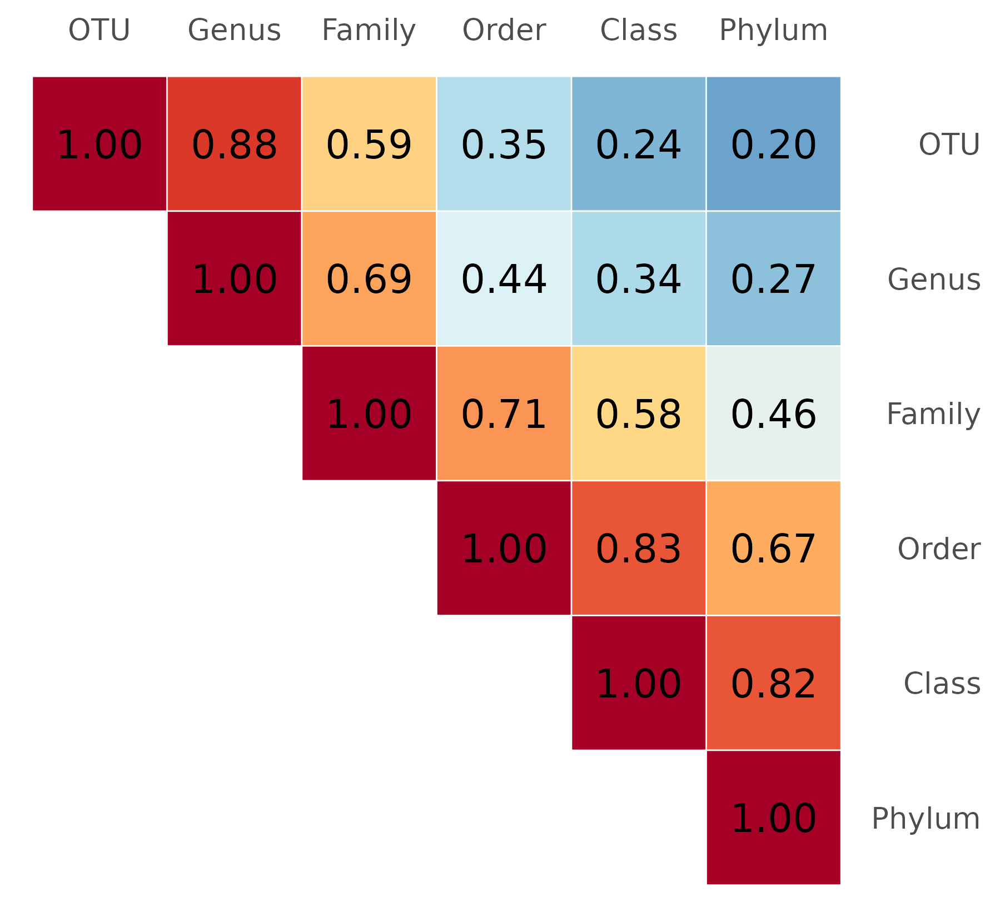
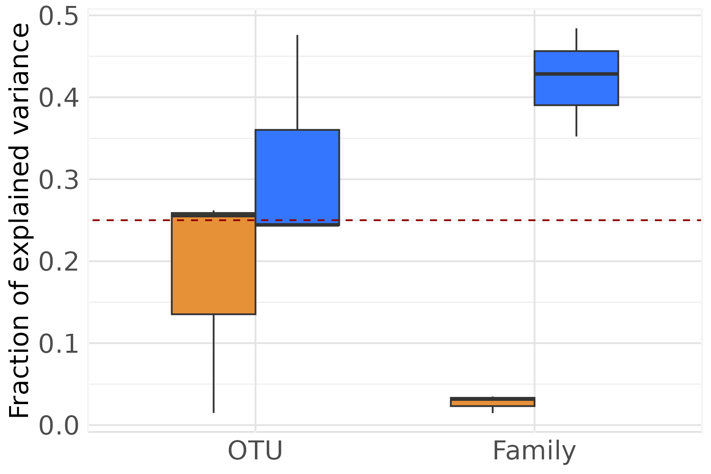
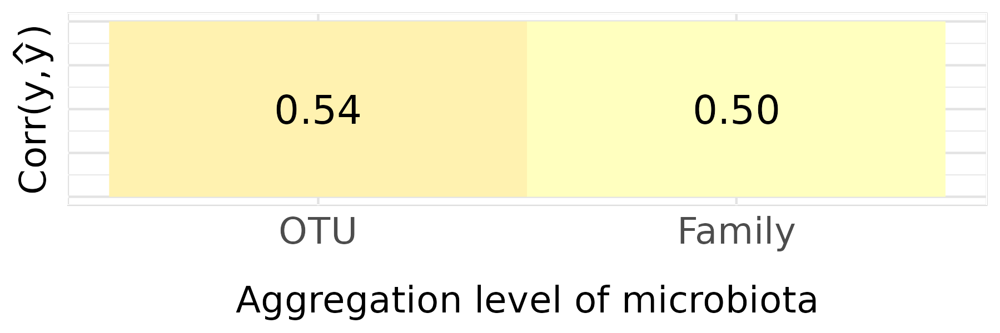
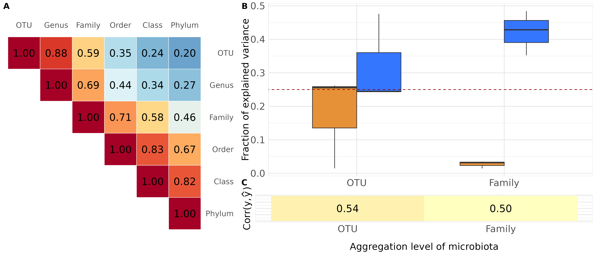
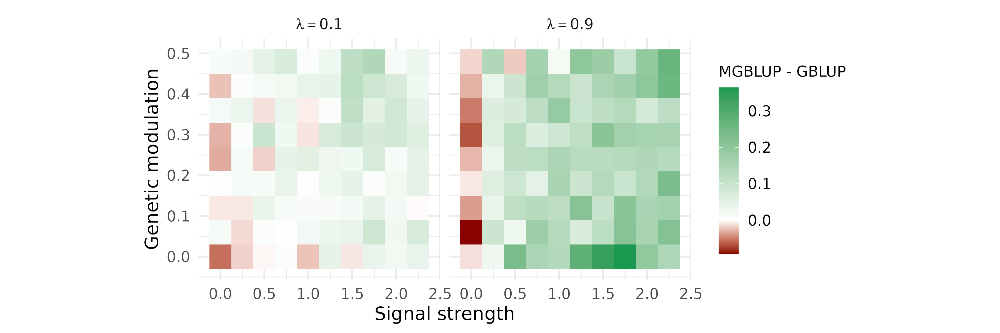

  
In this vignette, by generating controlled and contrasted biological scenarios across a broad parameter space, we examine how **microbiota granularity**, **variance structure** and **host modulation** influence variance component estimation and phenotypic prediction. We show that the added value of microbiota integration is highly context-dependent, and provide a structured framework to interrogate **when** and **how** integrating microbiota into models may enhance prediction in breeding applications. These results have been further detailed and explained in a **publication in preparation**.

```{r setup}
#| echo: no

knitr::opts_chunk$set(message  = FALSE,
                      warning  = FALSE,
                      echo     = TRUE,
                      collapse = TRUE,
                      eval     = FALSE,
                      comment  = "#>")
```

```{r init}
#| class.source: fold-show
#| eval: yes

library(magrittr)
library(MoBPS)
library(cowplot)
library(tidyverse)
library(ggrepel)
library(ggridges)
library(phyloseq)
library(ggh4x)
library(ggplot2)
library(glue)
library(BGLR)
library(ggtext)
library(RColorBrewer)
library(FactoMineR)
library(compositions)
library(RITHMS)
library(plyr)
```

```{r theme}
#| class.source: fold-show
#| eval: yes

greens_pal <- c("#6df17c", "#2ede41", "#26c537", "#1da42c", "#157e21", "#0E5e17")

session_theme <- theme_minimal() +
  theme(
    panel.border     = element_rect(colour = "white", fill = NA),
    panel.grid.major = element_line(colour = "#e3e3e3"),
    panel.grid.minor = element_line(colour = "#e9e9e9"),
    axis.title       = element_text(size = 8),
    axis.text        = element_text(size = 7),
    plot.title       = element_text(size = 12),
    legend.title     = element_text(size = 7),
    legend.text      = element_text(size = 7),
    legend.position  = "none"
  )
theme_set(session_theme)
```

# **Load data**

The data matrix loaded is the count matrix of taxa (in columns) across
individuals (in rows). In our toy dataset, a subset from
[Déru et al. 2020](https://pmc.ncbi.nlm.nih.gov/articles/PMC7538339/), there
are **1845 species** and **780 individuals** coming from the conventional diet.
Genotypes are encoded as 0, 1, 2 and reachable thanks to the *"population"*
attribute.

```{r load-data}
#| class.source: fold-show
#| eval: yes

data("Deru")
founder_object <- Deru
founder_object$microbiome[1:5, 1:5]
```

```{r load-metadata}
#| class.source: fold-show
#| eval: yes

data("taxonomy")
taxonomy <- taxonomy

taxonomy[1:5, 1:5]
```

```{r load-genotypes}
#| class.source: fold-show
#| eval: yes

genotypes <- founder_object$population %>%
  get.geno(gen = 1)

genotypes[1:5, 1:5]
```

# **Additional functions**

Helper functions specific to this study cover kernel construction, model
fitting, and result extraction. They are defined once here and shared across
all sections. Note that in `run_BGLR()` function, `nIter=10` in this vignette but was at 1000 to generate the following figures.

```{r helper-functions}
#| eval: yes

aggregate_at_rank <- function(microbiota, taxonomy, rank = "Genus",
                              taxa_assign = NULL) {
  if (rank %in% colnames(taxonomy)) {
    id_group <- dplyr::inner_join(
      microbiota |> t() |> as_tibble(rownames = "OTU"),
      taxonomy, by = "OTU"
    ) |>
      dplyr::select(!prevalence) |>
      drop_na() |>
      group_by(.data[[rank]])
    agg_microbio <- id_group |>
      summarise_if(is.numeric, sum) |>
      column_to_rownames(rank) |>
      t() |>
      as_tibble()
    attr(agg_microbio, "agg_id") <- group_indices(id_group)
  } else {
    id_group <- microbiota |> t() |> as_tibble() |>
      mutate(assignation = glue("Cluster_{taxa_assign}")) |>
      group_by(assignation)
    agg_microbio <- id_group |>
      dplyr::summarise(across(-any_of("assignation"), sum)) |>
      drop_na() |>
      column_to_rownames("assignation") |>
      t() |>
      as_tibble()
    attr(agg_microbio, "agg_id") <- group_indices(id_group)
  }
  return(agg_microbio)
}

process_microbiome <- function(agg_microbiome) {
  B_scaled <- agg_microbiome |> map(clr) |> identity()
  B        <- lapply(B_scaled, as.data.frame)
  B_full   <- B |> bind_rows(.id = "Generation")
  return(B_full[, -1])
}

build_kernel_agg <- function(gen_simu, taxonomy_table, agg_level,
                             taxa_assign = NULL) {
  B_long <- gen_simu[-c(1, 2, 3)] |>
    map(get_microbiomes, transpose = TRUE, CLR = FALSE)
  B_agg  <- B_long |>
    map(aggregate_at_rank,
        taxonomy    = taxonomy_table,
        rank        = agg_level,
        taxa_assign = taxa_assign)
  M_join <- process_microbiome(B_agg)
  p      <- ncol(M_join)
  tcrossprod(scale(as.matrix(M_join))) / p
}

build_kernel <- function(gen_simu,
                         type = "M"){
  if(type == "M"){
    #####
    # Extract microbiomes
    #####
    B_long <- gen_simu[-c(1,2,3)] |> map(get_microbiomes, transpose = T, CLR = F) 
    
    M_join <- process_microbiome(B_long)
    M_scaled <- scale(as.matrix(M_join))
    p <- ncol(M_scaled)
    K <- tcrossprod(M_scaled)/p
  }else{
    #####
    # Extract genotypes
    #####
    G_long <- gen_simu[-c(1,2,3)] |> map(get_genotypes) |> bind_rows()
    G_scaled <- safe_scale(G_long)
    s <- ncol(G_scaled)
    K <- tcrossprod(G_scaled)/s
  }
  return(K)
}

safe_scale <- function(G) {
  center <- colMeans(G, na.rm = TRUE)
  scale_ <- apply(G, 2, sd, na.rm = TRUE)
  
    scale_[is.na(scale_) | scale_ == 0] <- 1
  
  G_centered <- sweep(G, 2, center, "-")
  G_scaled <- sweep(G_centered, 2, scale_, "/")
  
  return(as.matrix(G_scaled))
}

get_genotypes <- function(data) {
  return(data |> pluck("genotypes") |> t() |> as.data.frame())
}

run_BGLR <- function(G, M = NULL, yNA, index) {
  set.seed(Sys.time())
  ETA <- list(genotype = list(K = G, model = "RKHS", scale = FALSE))
  if (!is.null(M))
    ETA[["microbiota"]] <- list(K = M, model = "RKHS", scale = FALSE)
  fm <- BGLR(y = yNA, ETA = ETA, nIter = 3000, burnIn = 1000,
             saveAt = "RKHS_", verbose = FALSE)
  list(
    coeffMHat = if (is.null(M)) NULL else fm[["ETA"]][["microbiota"]][["u"]],
    coeffGHat = fm[["ETA"]][["genotype"]][["u"]],
    varM = if (is.null(M)) NULL else
             mean(scan("RKHS_ETA_microbiota_varU.dat", quiet = TRUE), na.rm = TRUE),
    varG = mean(scan("RKHS_ETA_genotype_varU.dat", quiet = TRUE), na.rm = TRUE),
    varE = mean(scan("RKHS_varE.dat",              quiet = TRUE), na.rm = TRUE),
    yHat = fm$yHat[index]
  )
}

## Unified MBLUP_kernel:
##   agg_level = NULL  → build_kernel(type = "G"/"M")
##   agg_level = "Family" etc. → build_kernel_agg(...)
MBLUP_kernel <- function(gen_simu,
                         MBLUP          = FALSE,
                         taxonomy_table = NULL,
                         agg_level      = NULL,
                         taxa_assign    = NULL) {
  last_gen <- tail(names(gen_simu), n = 1)

  if (!is.null(agg_level)) {
    M <- if (MBLUP)
           build_kernel_agg(gen_simu       = gen_simu,
                            taxonomy_table = taxonomy_table,
                            agg_level      = agg_level,
                            taxa_assign    = taxa_assign)
         else NULL
  } else {
    M <- if (MBLUP) build_kernel(gen_simu = gen_simu, type = "M") else NULL
  }

  G        <- build_kernel(gen_simu = gen_simu, type = "G")
  Y        <- gen_simu[-c(1, 2, 3)] |> map(get_phenotypes) |>
                bind_rows(.id = "Generation")
  yNA      <- Y$y
  G5_index <- which(Y$Generation == last_gen)
  yNA[G5_index] <- NA

  results <- run_BGLR(G = G, M = M, yNA = yNA, index = G5_index)

  tibble(
    coeffMHat = list(results$coeffMHat),
    coeffGHat = list(results$coeffGHat),
    varM      = list(results$varM),
    varG      = list(results$varG),
    varE      = list(results$varE),
    gb        = list(Y$gb),
    gq        = list(Y$gq),
    real_y    = list(Y$y[G5_index]),
    yHat      = list(results$yHat)
  )
}
```

# **Explore the correlation between kernel matrices**

We first examine how kernel matrices built from microbiota data at different
taxonomic levels relate to one another. For each simulation replicate, we
construct six kernel matrices — from OTU to Phylum level — and compute pairwise
RV coefficients between them using `coeffRV()` from **FactoMineR**. A RV
coefficient close to 1 indicates that two matrices carry similar structural
information about inter-individual relationships.

## Simulation

For each replicate, we simulate a hologenomic population with `holo_simu()` and
compute pairwise RV coefficients between the six kernel matrices. The chunk
below runs **3 replicates** for illustration; the results presented in the paper
were obtained from **100 replicates** (seeds drawn via
`sample(100:100000, 100)` with `set.seed(200)`).

```{r run-kernel-correlation, eval=FALSE}
#| 
agg_levels <- c("OTU", "Genus", "Family", "Order", "Class", "Phylum")

n_it  <- 3
set.seed(200)
seeds <- sample(100:100000, n_it)

cor_results_list <- vector("list", n_it)

for (i in seq_len(n_it)) {
  taxa_assign_g <- assign_taxa(
    founder_object,
    type     = "Family",
    taxonomy = taxonomy,
    seed     = seeds[i]
  )
  generations_simu <- holo_simu(
    h2               = 0.25,
    b2               = 0.25,
    correlation      = 0.5,
    n_gen            = 5,
    founder_object   = founder_object,
    n_clust          = taxa_assign_g,
    n_ind            = 300,
    verbose          = FALSE,
    noise.microbiome = 0.6,
    effect.size      = 0.3,
    lambda           = 0.5,
    selection        = FALSE,
    taxonomy_table   = taxonomy,
    aggregate_rank   = "Family",
    seed             = seeds[i]
  )
  kernels_agg <- lapply(agg_levels, function(lvl)
    build_kernel_agg(generations_simu,
                     taxonomy_table = taxonomy,
                     agg_level      = lvl,
                     taxa_assign    = taxa_assign_g)
  )
  pairs <- combn(seq_along(kernels_agg), 2)
  cors  <- apply(pairs, 2, function(idx)
    coeffRV(kernels_agg[[idx[1]]], kernels_agg[[idx[2]]])$rv
  )
  mat <- matrix(NA, 6, 6)
  mat[upper.tri(mat)] <- cors
  diag(mat) <- 1
  cor_results_list[[i]] <- mat
}

saveRDS(cor_results_list, "vignette_kernel_corr.rds")
```

## Averaging across replicates

```{r aggregate-corr-results,eval=FALSE}
#| eval: no

cor_results_list <- readRDS("vignette_kernel_corr.rds")

mean_mat <- Reduce("+",
  lapply(cor_results_list, function(m) { m[is.na(m)] <- 0; m })
) / Reduce("+",
  lapply(cor_results_list, function(m) !is.na(m))
)

idx <- which(upper.tri(mean_mat), arr.ind = TRUE)
idx <- idx[order(idx[, 1], idx[, 2]), ]
mean_mat[idx] <- mean_mat[upper.tri(mean_mat)]

colnames(mean_mat) <- rownames(mean_mat) <-
  c("OTU", "Genus", "Family", "Order", "Class", "Phylum")
```

## Figure 1A

The heatmap below displays the mean RV coefficient between each pair of
aggregation levels. Values close to 1 indicate that the two kernels encode
similar inter-individual similarity structures.

> **Note.** The figure shown here is based on 3 replicates. Figure 1A in the
> paper is based on 100 replicates and may differ slightly.

```{r fig-kernel-correlation,eval=FALSE}
#| eval: no
#| fig.width: 6
#| fig.height: 5.5

agg_levels <- c("OTU", "Genus", "Family", "Order", "Class", "Phylum")

df_corr <- mean_mat |>
  as.data.frame() |>
  rownames_to_column("Var1") |>
  pivot_longer(-Var1, names_to = "Var2", values_to = "value") |>
  mutate(
    Var1 = factor(Var1, levels = rev(agg_levels)),
    Var2 = factor(Var2, levels = agg_levels)
  ) |>
  filter(!is.nan(value))

p_corr <- ggplot(df_corr, aes(Var2, Var1, fill = value)) +
  geom_tile(color = "white") +
  geom_text(aes(label = sprintf("%.2f", value)), size = 6) +
  scale_fill_gradientn(
    colours = rev(brewer.pal(10, "RdYlBu")),
    limits  = c(0, 1),
    oob     = scales::squish,
    name    = "Correlation"
  ) +
  coord_fixed() +
  theme_minimal(base_size = 16) +
  scale_y_discrete(position = "right") +
  scale_x_discrete(position = "top") +
  theme(
    axis.title      = element_blank(),
    panel.grid      = element_blank(),
    legend.position = "none"
  )
p_corr

ggsave("../man/figures/kernel_corplots.png")
```

{width=80%}

# **Variance decomposition and phenotypic prediction across aggregation levels**

We evaluate how the choice of taxonomic aggregation level affects two
objectives: (i) the accuracy of variance component estimation (microbiability
$\hat{b}^2$ and direct heritability $\hat{h}^2_d$), and (ii) phenotypic
prediction accuracy in the last generation. For each replicate and each
aggregation level, we fit an MGBLUP model using `MBLUP_kernel()`, which wraps a
BGLR RKHS fit on both the microbiota kernel and the genomic relationship matrix.

## Simulation

The chunk below runs **3 replicate × 2 aggregation levels** for illustration;
the paper used **500 replicates × 6 levels**.

```{r run-variance-decomp,eval=FALSE}

agg_levels_demo <- c("OTU", "Family")
n_it  <- 3
set.seed(200)
seeds <- sample(100:100000, n_it)

results_list <- vector("list", 0)

for (lvl in agg_levels_demo) {
  for (i in seq_len(n_it)) {
    taxa_assign_g <- assign_taxa(
      founder_object,
      type     = "hclust",
      taxonomy = taxonomy,
      seed     = seeds[i]
    )
    generations_simu <- holo_simu(
      h2               = 0.25,
      b2               = 0.25,
      correlation      = 0.5,
      n_gen            = 5,
      founder_object   = founder_object,
      n_clust          = taxa_assign_g,
      n_ind            = 300,
      verbose          = FALSE,
      noise.microbiome = 0.6,
      effect.size      = 0.3,
      lambda           = 0.5,
      selection        = FALSE,
      taxonomy_table   = taxonomy,
      aggregate_rank   = "Family",
      seed             = seeds[i]
    )
    res <- MBLUP_kernel(generations_simu,
                        MBLUP          = TRUE,
                        taxonomy_table = taxonomy,
                        agg_level      = lvl) |>
      mutate(sim_ID = i, agg_level = lvl, seed = seeds[i])
    results_list <- c(results_list, list(res))
  }
}

df <- bind_rows(results_list)
saveRDS(df, "vignette_variance_decomp.rds")
```

## Data preparation

```{r load-variance-decomp, eval=FALSE}
#| eval: no

df <- readRDS("vignette_variance_decomp.rds")

agg_levels_ord <- c("OTU", "Genus", "Family", "Order", "Class", "Phylum")

df_join <- df |>
  mutate(
    varM   = unlist(varM),
    varG   = unlist(varG),
    varE   = unlist(varE),
    b2_hat = varM / (varE + varM + varG),
    h2_hat = varG / (varE + varM + varG)
  ) |>
  pivot_longer(c(b2_hat, h2_hat), values_to = "Estimate", names_to = "Metric")

test <- df_join |>
  mutate(varE = ifelse(is.nan(varE), NA, varE)) |>
  group_by(agg_level) |>
  mutate(
    mu       = mean(log(varE), na.rm = TRUE),
    sigma    = sd(log(varE),   na.rm = TRUE),
    varE_imp = ifelse(is.na(varE), exp(rnorm(1, mu, sigma)), varE)
  ) |>
  ungroup()
```

## Figure 1B — Variance decomposition

```{r fig-variance-decomp, eval=FALSE}
#| eval: no
#| fig.width: 6
#| fig.height: 4

p2 <- test |>
  mutate(
    Estimate  = if_else(
      is.na(varE),
      if_else(Metric == "b2_hat",
              varM / (varE_imp + varM + varG),
              varG / (varE_imp + varM + varG)),
      Estimate
    ),
    agg_level = factor(agg_level, levels = agg_levels_ord)
  ) |>
  ggplot(aes(x = agg_level, y = Estimate, fill = as.factor(Metric))) +
  geom_boxplot(width = 0.6, position = "dodge", outliers = FALSE) +
  geom_abline(intercept = 0.25, slope = 0, linetype = 2, color = "darkred") +
  scale_fill_manual(values = c("#e69138ff", "#3576ffff")) +
  labs(
    y     = "Fraction of explained variance"
  ) +
  theme(
    panel.background    = element_rect(fill = "white"),
    panel.grid.major    = element_line(colour = "#e3e3e3"),
    panel.grid.minor    = element_line(colour = "#e9e9e9"),
    axis.title          = element_text(size = 16),
    axis.title.x        = element_blank(),
    axis.text           = element_text(size = 16),
    plot.title          = element_markdown(size = 16, hjust = 0.5,
                                           margin = margin(b = 6)),
    legend.position     = "none"
  )
p2

ggsave("../man/figures/variance_est_boxplot.png")
```

{width=80%}

## Figure 1C — Phenotypic prediction accuracy

```{r fig-prediction-accuracy, eval=FALSE}
#| eval: no
#| fig.width: 6
#| fig.height: 2

p3 <- test |>
  rowwise() |>
  dplyr::mutate(
    cor_y     = cor(real_y, yHat),
    agg_level = factor(agg_level, levels = agg_levels_ord)
  ) |>
  ungroup() |>
  dplyr::summarise(mean_cor_y = mean(cor_y), .by = agg_level) |>
  ggplot(aes(x = agg_level, y = 0, fill = mean_cor_y)) +
  geom_raster() +
  geom_text(aes(label = sprintf("%.2f", mean_cor_y)), size = 6) +
  scale_fill_gradientn(
    colours = rev(brewer.pal(5, "RdYlBu")),
    limits  = c(0, 1),
    oob     = scales::squish
  ) +
  labs(
    x = "Aggregation level of microbiota",
    y = expression(paste("Corr(" * y * "," * hat(y) * ")"))
  ) +
  theme(
    panel.background = element_rect(fill = "white"),
    panel.grid.major = element_line(colour = "#e3e3e3"),
    panel.grid.minor = element_line(colour = "#e9e9e9"),
    axis.title       = element_text(size = 16),
    axis.title.x     = element_text(margin = margin(t = 15)),
    axis.text        = element_text(size = 16),
    axis.text.y      = element_blank(),
    axis.ticks.y     = element_blank(),
    legend.position  = "none"
  )
p3

ggsave("../man/figures/pheno_cor.png")
```

{width=80%}

## Figure 1 — Assembly

> **Note.** The figures shown here are based on 3 replicates × 2 aggregation
> levels. Figure 1 in the paper uses 500 replicates × 6 levels.

```{r fig1-assembly, eval=FALSE}
#| eval: no

B_C <- plot_grid(p2, p3,
                 nrow        = 2,
                 labels      = c("B", "C"),
                 rel_heights = c(3, 1),
                 vjust       = c(1.5, -1))

fig1 <- plot_grid(p_corr, B_C,
                  labels     = c("A", ""),
                  rel_widths = c(1, 1.5))
fig1

ggsave("../man/figures/fig1.png", width = 14, height = 6)
```

{width=80%}

# **Comparing MGBLUP and GBLUP across simulation conditions**

We compare the phenotypic prediction accuracy of MGBLUP (genomic + microbiota
kernels) against GBLUP (genomic kernel only) across a grid of simulation
conditions defined by two parameters: the microbiome signal strength
($b^2 / h^2$) and the genetic modulation of microbiota composition
(`effect.size` $/ \sqrt{p}$, with $p = 100$ OTU groups). Prediction accuracy
is measured as the correlation between observed and predicted phenotypes in the
last generation. The difference $\Delta = r_\text{MGBLUP} - r_\text{GBLUP}$ is
averaged across replicates and displayed as a contour plot for three values of
the transmission parameter $\lambda$.

## Simulation

The parameter grid follows a simplified design as the one in the paper. To reproduce the one from the article, change the values in the following chunk with these one : 25 values of $b^2$
(`seq(0, 0.49, 0.02)`), 25 values of `effect.size` (`seq(0, 4.8, 0.2)`), and
three values of $\lambda$ (`0.1, 0.5, 0.9`). The chunk below runs **1
replicate** across the grid for illustration; the paper used **100
replicates**.

```{r run-contour, eval=FALSE}

set.seed(200)
n_it = 1
params_df_full <- tibble(b2   = seq(0, 0.49, 0.05)) |>
  crossing(tibble(effect.size = seq(0, 4.8,  0.6)),
           tibble(lambda      = c(0.1, 0.9)), 
           tibble(replicate = 1:n_it)) |>
  dplyr::mutate(sim_ID = row_number(),
         seed   = sample(100:1000000, n()),
         .before = everything())

results_list <- vector("list", nrow(params_df_full))

for (i in seq_len(nrow(params_df_full))) {
  print(i)
  p <- params_df_full[i, ]

  taxa_assign_g <- assign_taxa(
    founder_object,
    type     = "hclust",
    taxonomy = taxonomy,
    seed     = p$seed
  )
  generations_simu <- holo_simu(
    h2               = 0.2,
    b2               = p$b2,
    correlation      = 0.5,
    n_gen            = 3,
    founder_object   = founder_object,
    n_clust          = taxa_assign_g,
    n_ind            = 300,
    verbose          = FALSE,
    noise.microbiome = 0.6,
    effect.size      = p$effect.size,
    lambda           = p$lambda,
    selection        = FALSE,
    taxonomy_table   = taxonomy,
    aggregate_rank   = "Family",
    seed             = p$seed
  )

  res_gblup <- MBLUP_kernel(generations_simu, MBLUP = FALSE) |>
    dplyr::mutate(sim_ID = p$sim_ID, id_source = "GBLUP",
           b2 = p$b2, effect.size = p$effect.size, lambda = p$lambda)

  res_mgblup <- MBLUP_kernel(generations_simu, MBLUP = TRUE) |>
    dplyr::mutate(sim_ID = p$sim_ID, id_source = "MGBLUP",
           b2 = p$b2, effect.size = p$effect.size, lambda = p$lambda)

  results_list[[i]] <- bind_rows(res_gblup, res_mgblup)
}

df_contour <- bind_rows(results_list)
saveRDS(df_contour, "vignette_contour.rds")
```

## Data preparation

```{r load-contour,eval=FALSE}
#| eval: no

df_contour <- readRDS("vignette_contour.rds")

contour_df <- df_contour |>
  mutate(
    real_y          = map(real_y, unlist),
    yHat            = map(yHat,   unlist),
    cor_y           = map2_dbl(real_y, yHat, cor),
    signal_strength = b2 / 0.2,
    gen_mic         = effect.size / sqrt(100)
  ) |>
  select(cor_y, signal_strength, gen_mic, sim_ID, id_source, lambda) |>
  pivot_wider(names_from = id_source, values_from = cor_y) |>
  dplyr::mutate(delta = MGBLUP - GBLUP) |>
  dplyr::summarise(mean_delta = mean(delta, na.rm = TRUE),
            n          = n(),
            .by        = c(signal_strength, gen_mic, lambda))
```

## Figure 2

```{r fig2, eval=FALSE}
#| eval: no

p_contour <- contour_df |>
  mutate(lambda_lab = glue("lambda=={lambda}")) |>
  ggplot(aes(x = signal_strength, y = gen_mic, fill = mean_delta)) +
  geom_tile() +
  scale_fill_gradientn(
    colors = c("darkred", "#ffffff", "#1a9850"),
    values = scales::rescale(
      c(min(contour_df$mean_delta), 0, max(contour_df$mean_delta))
    ),
    name = "MGBLUP - GBLUP"
  ) +
  facet_grid(~ lambda_lab, labeller = label_parsed) +
  theme_minimal(base_size = 16) +
  labs(x = "Signal strength",
       y = "Genetic modulation") +
  theme(
    aspect.ratio    = 1,
    legend.position = "right",
    legend.title    = element_text(size = 13)
  ) +
  guides(fill = guide_colorbar(barwidth = 1.2, barheight = 10))
p_contour

ggsave("../man/figures/contour_plot.png", width = 12, height = 4)
```

> **Note.** The figure shown here is based on 1 replicate across the simplified
> parameter grid. Figure 2 in the paper averages over 100 replicates and may
> differ substantially in the intermediate regime where $\Delta$ is close to
> zero.

{width=80%}
---

**For any ideas or collaboration relating to the package, feel free to contact:
solene.pety@inrae.fr**
