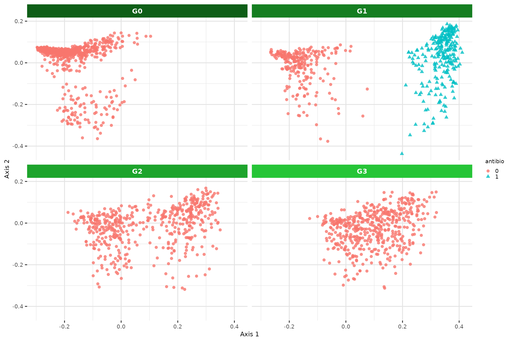
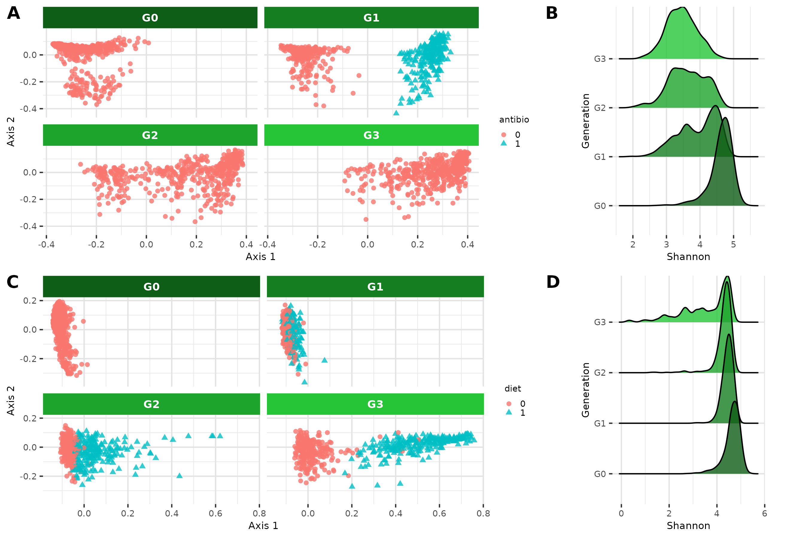

```{r, include = FALSE}
knitr::opts_chunk$set(
  collapse = TRUE,
  comment = "#>"
)
```

```{r}
library(RITHMS)
```

<!-- WARNING - This vignette is generated by {fusen} from dev/generate-figures.Rmd: do not edit by hand -->


```{r setup}
knitr::opts_chunk$set(message=FALSE,
                      warning=FALSE,
                      echo = TRUE,
                      collapse = TRUE,
                      eval = FALSE,
                      comment = "#>")
```


```{r init}
#| class.source: fold-show


library(RITHMS)
library(MoBPS)
library(dplyr)
library(compositions)
library(glue)
library(purrr)
library(bazar)
library(dirmult)
library(stringr)
library(ComplexHeatmap)
library(circlize)
library(ggplot2)
library(cowplot)
library(phyloseq)
library(tidyr)
library(ggrepel)
library(ggridges)
library(ggh4x)
library(furrr)
library(peakRAM)
```


```{r}
#| class.source: fold-show

greens_pal <- c("#6df17c","#2ede41","#26c537","#1da42c","#157e21","#0E5e17")
```


```{r}
#| class.source: fold-show

datafile <- system.file("DeruPop.rds", package = "RITHMS")
founder_object <- readRDS(datafile)
```


# **Fig 3. Microbiome : simulation reflects structure of microbiome**
  
## **A. Correlation heatmap**  
  
```{r}
#| class.source: fold-show

taxa_assign_g_small <- assign_taxa(founder_object, 
                                   taxa_g = 0.04)


noise = 0.6
effect.size = 0.3
lambda = 0.5
center_bg = T
dir = T
generations_simu <- holo_simu(h2 = 0.25,
                              b2 = 0.25,
                              founder_object = founder_object,
                              n_clust = taxa_assign_g_small,
                              n_ind = 500,
                              verbose = F,
                              noise.microbiome = noise,
                              effect.size = effect.size,
                              lambda = lambda,
                              dir = dir,
                              selection = F,
                              seed = 333)

```


```{r}
#Correlation intra-cluster for cluster under genetic control
beta <- generations_simu$metadata$Beta_matrix[taxa_assign_g_small != 0,]
cor_matrix <- cor(t(beta))
taxa_order <- taxa_assign_g_small[taxa_assign_g_small != 0] %>% order()
cor_matrix <- cor_matrix[taxa_order,taxa_order]

pal <- colorRampPalette(RColorBrewer::brewer.pal(5,"Set1"))(length(taxa_assign_g_small[taxa_assign_g_small != 0] %>% unique()))
clus_col <- structure(pal, names = taxa_assign_g_small[taxa_assign_g_small != 0] %>% unique() %>% as.vector())

leftAnn = rowAnnotation(clust = taxa_assign_g_small[taxa_assign_g_small != 0] %>% sort(),
                        col = list(clust = clus_col),
                        show_annotation_name = F,
                        annotation_legend_param = list(clust = list(title = "Cluster ID",title_gp = gpar(fontsize = 5, fontface = "bold"), labels_gp = gpar(fontsize = 5, fontface = 'bold'))))
colAnn = HeatmapAnnotation(clust = taxa_assign_g_small[taxa_assign_g_small != 0] %>% sort(),
                        col = list(clust = clus_col),
                        show_annotation_name = F,
                        show_legend = FALSE)

col_fun = colorRamp2(c(min(cor_matrix), 0, max(cor_matrix)), c("blue", "white", "red"))

p1 <- grid.grabExpr(draw(Heatmap(cor_matrix, 
        cluster_rows = F, 
        cluster_columns = F, 
        show_row_names = F, 
        show_column_names = F,
        left_annotation = leftAnn,
        top_annotation = colAnn,
        #col = col_fun,
        heatmap_legend_param = list(title = "Correlation", title_gp = gpar(fontsize = 5, fontface = "bold"), labels_gp = gpar(fontsize = 5, fontface = 'bold')))))

plot_grid(p1)

ggsave("../man/figures/Heatmap_correlation.png", p1, width = 9, height = 6)
```


{width=80%}

## **B. Lambda values**  
  
```{r}
set.seed(484)
#Change n_it to increase the accuracy of the function, n_it = 10 used in the article
n_it = 1
seed_value <- sample(c(100:9999),n_it)

taxa_assign_g <- assign_taxa(founder_object)
```


```{r}
#| class.source: fold-show

noise = 0.1
effect.size = 0.1
center_bg = T
dir = T
lambda = c(0,0.5,1)

#Boxplot lambda vs diversity correlation with offspring
  cor_gen_table <- data.frame()
  for(s in seed_value){
    print(glue("Seed : {s}"))
    for(l in lambda){
      print(glue("Lambda : {l}"))
      generations_simu <- holo_simu(h2 = 0.25,
                                    b2 = 0.25,
                                    founder_object = founder_object,
                                    n_clust = taxa_assign_g,
                                    n_ind = 500,
                                    verbose = F,
                                    noise.microbiome = noise,
                                    effect.size = effect.size,
                                    lambda = l,
                                    dir = dir,
                                    selection = F,
                                    seed = s)

      current_div <- generations_simu$G2$microbiome %>% richness_from_abundances_gen()
      previous_s_div <- sapply(generations_simu$G2$pedigree[,"father"],function(x){generations_simu$G1$microbiome[,x]}) %>% richness_from_abundances_gen()
      previous_d_div <- sapply(generations_simu$G2$pedigree[,"mother"],function(x){generations_simu$G1$microbiome[,x]}) %>% richness_from_abundances_gen()
      ambient_div <- generations_simu$G2$mean_microbiome %>% richness_from_abundances_gen()
      cor_gen_table <- rbind(cor_gen_table,
                           cbind(l,
                                 cor(current_div$Shannon,previous_d_div$Shannon),
                                 cor(current_div$Shannon,previous_s_div$Shannon),
                                 cor(current_div$Shannon,ambient_div$Shannon)))
    }
  }
  colnames(cor_gen_table) <- c("lambda","Mother","Father","Ambient")
  long_cor_gen <- cor_gen_table %>% pivot_longer(c("Mother","Father","Ambient"),
                                                 names_to = "cor_type",
                                                 values_to = "value")
  
```


```{r}

lambda_label <- cbind(x = c(0,0.5,1),
                      y = c(0.8,0.2,0.8),
                      label = c("Ambient","Father","Mother")) %>% as.data.frame()
lambda_label$y <- as.numeric(lambda_label$y)

p3 <- long_cor_gen %>% summarise(value = mean(value), .by = c(lambda, cor_type)) |> ggplot(aes(x=as.factor(lambda),y=value,col=cor_type, group = cor_type)) +
  geom_line() +
  geom_point( alpha=0.8)  +
  geom_text_repel(data = lambda_label,
                  aes(x = x, y = y, label = label, color = label, group = NULL),
        direction = "y",
        show.legend = FALSE) +
  theme(panel.background = element_rect(fill="white"),
        panel.grid.major = element_line(colour="#e3e3e3"),
        panel.grid.minor = element_line(colour="#e9e9e9"),
        axis.title = element_text(size = 8),
        axis.text = element_text(size=7),
        plot.title = element_text(size=12),
        legend.key.size = unit(0.25, 'cm'), #change legend key size
        legend.title = element_text(size=7), #change legend title font size
        legend.text = element_text(size=7),
        legend.position = "none") +
  ylab("Correlation value") +
  xlab("Lambda") +
  labs(col = "Parents") +
  guides(shape = "none") +
  ylim(-0.2,1) +
  scale_y_continuous(
    breaks = seq(0,1,0.25),
    labels = seq(0,1,0.25)
  ) +
  scale_color_brewer(palette = "Dark2")

p3
ggsave("../man/figures/lambda_correlation.png", p3, width = 9, height = 6)
```


{width=80%}

## **C. Taxa heritability according to genetic effect**  
  
```{r}

out_data <- gen_effect_calibration(founder_object = founder_object,
                                   taxa_assign_g = taxa_assign_g,
                                   correlation = 0.5,
                                  effect.size = c(0.3,0.6,1),
                                  plot = F)


  # Calculate density peaks
density_peaks <- out_data %>%
  group_by(effect.size) %>%
  summarise(
    peak = density(Heritability)$y[which.max(density(Heritability)$y)],
    peak_x = density(Heritability)$x[which.max(density(Heritability)$y)]
  )

  p2 <- out_data %>% ggplot(aes(x=Heritability,fill=as.factor(effect.size), label = as.factor(effect.size))) +
      geom_density(alpha=0.8, color = NA)+
      geom_text_repel(
        data = density_peaks,
        aes(x = peak_x, y = peak, label = effect.size, color = as.factor(effect.size)),
        nudge_x = 0.02,
        nudge_y = 0.3,
        direction = "y",
        show.legend = FALSE) +
      labs(x = "Taxa heritability",
           y = "Density",
           fill = "Genetic effect size")+
      theme(panel.background = element_rect(fill="white"),
            panel.grid.major = element_line(colour="#e3e3e3"),
            panel.grid.minor = element_line(colour="#e9e9e9"),
            axis.title = element_text(size = 8),
            axis.text = element_text(size=7),
            plot.title = element_text(size=7),
            legend.position = "none") +
    scale_fill_manual(values = c("#00AFBB", "#E7B800", "#FC4E07")) +
    scale_color_manual(values = c("#00AFBB", "#E7B800", "#FC4E07"))
 p2
 ggsave("../man/figures/density_taxa_heri.png", p2, width = 9, height = 6)
```


  
## **D. Shannon diversity across generation**   
  
```{r}
#| include: no


#TODO à mettre dans flat_first
get_microbiomes <- function(data, transpose = F, CLR = F) {
  if(transpose){
    if(CLR){
      return(data |> pluck("microbiome") |> t() |> replace_zero() |> compositions::clr() |> as.data.frame())
    }else{
      return(data |> pluck("microbiome") |> t() |> as.data.frame())
    }
  }
  data |> pluck("microbiome") |> as.data.frame()
}

get_mean_phenotypes <- function(data) {
  data |> pluck("phenotypes","y") |> mean()
}

get_phenotypes_value <- function(data,value = "gq") {
  data |> pluck("phenotypes",value)
}

get_om_beta_g <- function(data) {
  data |> pluck("omega_beta_g")
}

get_selected_ind <- function(data) {
  data |> pluck("ID_selected")
}

get_phenotypes <- function(data) {
  data |> pluck("phenotypes") |> as.data.frame() |> as_tibble(rownames = "ID") 
}

get_mean_diversity <- function(data) {
  mean(data$Shannon)
}
```


  
```{r}
#| class.source: fold-show

h2 = 0.25
b2 = 0.25
generations_simu <- holo_simu(h2 = h2,
                              b2 = b2,
                              founder_object = founder_object,
                              n_clust = taxa_assign_g,
                              n_ind = 500,
                              verbose = F,
                              noise.microbiome = noise,
                              effect.size = effect.size,
                              lambda = 0.5,
                              dir = dir,
                              selection = F,
                              seed = 8082)

diversities_microbiomes <- generations_simu[-1] %>% map(get_microbiomes) %>% map(richness_from_abundances_gen) |> bind_rows(.id = "Generation")
  p4 <- ggplot(diversities_microbiomes,aes(x=Shannon,y=Generation,fill=Generation)) +
        geom_density_ridges(alpha=0.8) + 
        theme(legend.position = "none",
              panel.background = element_rect(fill="white"),
              panel.grid.major = element_line(colour="#e3e3e3"),
              panel.grid.minor = element_line(colour="#e9e9e9"),
              axis.title = element_text(size = 8),
              axis.text = element_text(size=7),
              plot.title = element_text(size=12),
              aspect.ratio = 1.5)+
  scale_fill_manual(values = rev(greens_pal))
  
p4
ggsave("../man/figures/ridges_shannon.png", p4, width = 9, height = 6)
```


{width=80%}
  
## **Global**  
  
```{r}
top_row <- plot_grid(p1,p2, ncol = 2, labels = c("A","B"))
bottom_row <- plot_grid(p3,p4, ncol = 2, labels = c("C","D"))
plot_grid(top_row, bottom_row,nrow=2)

ggsave("../man/figures/global_microbiome.png", plot_grid(top_row, bottom_row,nrow=2), width = 9, height = 6)
```


{width=80%}

# **Fig 4. Environmental effect**
  
## **A. MDS antibio effect**    
  
```{r}
#| class.source: fold-show

h2 = 0.25
b2 = 0.25
noise = 0.6
effect.size = 0.3
dir= T
n_ind = 500
lambda = 0.5

set.seed(42)
antibio <- rep(0, n_ind)
antibio_ind <- sample(1:n_ind, 250)
antibio[antibio_ind] <- 1 
X <- matrix(antibio, ncol = n_ind, nrow = 1)

# theta <- all taxa, big size effect with negative values
theta <- rnorm(ncol(founder_object),mean = 0, sd = 5)
theta <- ifelse(theta > 0, -theta, theta) %>% matrix(ncol = 1, nrow = ncol(founder_object))#Only negative values for all taxa

thetaX <- theta %*% X

generations_simu_env <- holo_simu(h2 = h2,
                                  b2 = b2,
                                  founder_object = founder_object,
                                  n_clust = taxa_assign_g,
                                  n_ind = n_ind,
                                  verbose = F,
                                  noise.microbiome = noise,
                                  effect.size = effect.size,
                                  lambda = lambda,
                                  dir = dir,
                                  selection = F,
                                  seed = 30,
                                  thetaX = thetaX,
                                  env_gen = c(F,T,F,F,F))
```


```{r}
diversities_microbiomes <- generations_simu_env[-1] %>% map(get_microbiomes) %>% map(richness_from_abundances_gen) |> bind_rows(.id = "Generation")

  p1 <- diversities_microbiomes %>% filter(!Generation %in% c("G4","G5")) %>%
    ggplot(aes(x=Shannon,y=Generation,fill=Generation)) +
    geom_density_ridges(alpha=0.8) + 
    theme(legend.position = "none",
          panel.background = element_rect(fill="white"),
          panel.grid.major = element_line(colour="#e3e3e3"),
          panel.grid.minor = element_line(colour="#e9e9e9"),
          axis.title = element_text(size = 8),
          axis.text = element_text(size=7),
          plot.title = element_text(size=12),
          aspect.ratio = 1.5)+
    scale_fill_manual(values = rev(greens_pal)[1:4])
  
  p1
  ggsave("../man/figures/antibio_shannon.png", p1, width = 9, height = 6)

```


{width=80%}

## **B. Diversity antibio effect**    
  
```{r}
microbiomes_all <- generations_simu_env[c(2,3,4,5)] %>% map(get_microbiomes, transpose = T, CLR = F) |> bind_rows(.id = "Generation")
                          
antibio_vec <- rep(0, nrow(microbiomes_all))
id_antibio_ind <- rownames(microbiomes_all)[which(microbiomes_all$Generation == "G1")] %in% colnames((generations_simu_env$G1$microbiome))[which(X != 0)]
antibio_vec[which(microbiomes_all$Generation == "G1")[id_antibio_ind]] <- 1
metadata <- cbind(Generation = microbiomes_all$Generation, ID = rownames(microbiomes_all), antibio = antibio_vec) |> as.data.frame()
rownames(metadata) <- metadata$ID

dist_mat <- vegan::vegdist(x = microbiomes_all[-1],
                 method = "bray")

physeq <- phyloseq(
  otu_table(t(microbiomes_all[,-1]), taxa_are_rows = TRUE),
  sample_data(metadata))

ord <- ordinate(physeq, method = "MDS", distance = dist_mat)

DF <- plot_ordination(physeq, ord, justDF = T)
p2 <- ggplot(data = DF, aes(x=DF[,1], y=DF[,2], color = antibio, shape=antibio)) + 
    labs(x = "Axis 1",
         y = "Axis 2") +
  geom_point(alpha = 0.8) + 
  theme(panel.background = element_rect(fill="white"),
            panel.grid.major = element_line(colour="#e3e3e3"),
            panel.grid.minor = element_line(colour="#e9e9e9"),
            axis.title = element_text(size = 8),
            axis.text = element_text(size=7),
            plot.title = element_text(size=7),
            legend.key.size = unit(0.25, 'cm'), #change legend key size
            legend.title = element_text(size=7), #change legend title font size
            legend.text = element_text(size=7),
            strip.text = element_text(color = "white", face = "bold")
        ) +
  facet_wrap2(~Generation, nrow = 2, ncol = 2, strip = strip_themed(background_x = elem_list_rect(fill = rev(greens_pal)[1:4])))

p2
ggsave("../man/figures/mds_antibio.png", p2, width = 9, height = 6)

```


{width=80%}
```{r}
top_row <- plot_grid(p2,p1, labels = c("A","B"),rel_widths = c(2,1))
```


  
## **C. MDS diet effect**    
  
```{r}
#| class.source: fold-show

h2 = 0.25
b2 = 0.25
noise = 0.6
effect.size = 0.3
dir= T
center_bg = T
n_ind = 500
lambda = 0.5

set.seed(56)
# Xi <- small portions of individuals
diet <- rep(0, n_ind)
diet_ind <- sample(1:n_ind, 250)
diet[diet_ind] <- 1 
X <- matrix(diet, ncol = n_ind, nrow = 1)

# theta <- all taxa, big size effect with negative values
theta <- rep(0, length(taxa_assign_g))
cluster_diet <- table(taxa_assign_g)[table(taxa_assign_g) > 10 & table(taxa_assign_g) < 30] %>% sample(3) %>% names() %>% as.numeric() #sample of clusters modulated by diet
theta[taxa_assign_g %in% cluster_diet] <- rnorm(sum(taxa_assign_g %in% cluster_diet ),mean = 0, sd = 2)
theta <- ifelse(theta < 0, -theta, theta) %>% matrix(ncol = 1, nrow = length(taxa_assign_g))#Only positive values for all taxa

thetaX <- theta %*% X

generations_simu_env <- holo_simu(h2 = h2,
                              b2 = b2,
                              founder_object = founder_object,
                              n_clust = taxa_assign_g,
                              n_ind = n_ind,
                              verbose = F,
                              noise.microbiome = noise,
                              effect.size = effect.size,
                              lambda = lambda,
                              dir = dir,
                              selection = F,
                              seed = 3042,
                              thetaX = thetaX,
                              env_gen = c(T,T,T,T,T))
```


```{r}
diversities_microbiomes <- generations_simu_env[c(2,3,4,5)] %>% map(get_microbiomes) %>% map(richness_from_abundances_gen) |> bind_rows(.id = "Generation")

  p4 <- ggplot(diversities_microbiomes,aes(x=Shannon,y=Generation,fill=Generation)) +
        geom_density_ridges(alpha=0.8) + 
        theme(legend.position = "none",
              panel.background = element_rect(fill="white"),
              panel.grid.major = element_line(colour="#e3e3e3"),
              panel.grid.minor = element_line(colour="#e9e9e9"),
              axis.title = element_text(size = 8),
              axis.text = element_text(size=7),
              plot.title = element_text(size=12),
              aspect.ratio = 1.5)+
        scale_fill_manual(values = rev(greens_pal)[1:4])
p4
ggsave("../man/figures/diet_shannon.png", p4, width = 9, height = 6)

```


{width=80%}
  
## **D. Diversity diet effect**    
 
```{r}
microbiomes_all <- generations_simu_env[c(2,3,4,5)] %>% map(get_microbiomes, transpose = T, CLR = F) |> bind_rows(.id = "Generation")

diet_vec <- rep(0, nrow(microbiomes_all))
diet_vec[which(microbiomes_all$Generation == "G1")[diet_ind]] <- 1
diet_vec[which(microbiomes_all$Generation == "G2")[diet_ind]] <- 1
diet_vec[which(microbiomes_all$Generation == "G3")[diet_ind]] <- 1
diet_vec[which(microbiomes_all$Generation == "G4")[diet_ind]] <- 1
diet_vec[which(microbiomes_all$Generation == "G5")[diet_ind]] <- 1

metadata <- cbind(Generation = microbiomes_all$Generation, ID = rownames(microbiomes_all), diet = diet_vec) |> as.data.frame()
rownames(metadata) <- metadata$ID

dist_mat <- vegan::vegdist(x = microbiomes_all[-1],
                 method = "bray")


physeq <- phyloseq(
  otu_table(t(microbiomes_all[,-1]), taxa_are_rows = TRUE),
  sample_data(metadata))

ord <- ordinate(physeq, method = "MDS", distance = dist_mat)

DF <- plot_ordination(physeq, ord, justDF = T)
p3 <- ggplot(data = DF, aes(x=DF[,1], y=DF[,2], color = diet, shape=diet)) + 
    labs(x = "Axis 1",
         y = "Axis 2") +
  geom_point(alpha = 0.8) + 
  theme(panel.background = element_rect(fill="white"),
            panel.grid.major = element_line(colour="#e3e3e3"),
            panel.grid.minor = element_line(colour="#e9e9e9"),
            axis.title = element_text(size = 8),
            axis.text = element_text(size=7),
            plot.title = element_text(size=7),
            legend.key.size = unit(0.25, 'cm'), #change legend key size
            legend.title = element_text(size=7), #change legend title font size
            legend.text = element_text(size=7),
            strip.text = element_text(color = "white", face = "bold")) +#change legend text font size) 
  facet_wrap2(~Generation, nrow = 2, ncol = 2, strip = strip_themed(background_x = elem_list_rect(fill = rev(greens_pal)[1:4]))) +
  scale_fill_manual(values = rev(greens_pal)[1:4])
p3
ggsave("../man/figures/mds_diet.png", p3, width = 9, height = 6)

```


{width=80%}
```{r}
bottom_row <- plot_grid(p3,p4, labels = c("C","D"),rel_widths = c(2,1))
```


  
## **Global**  
  
```{r}
plot_grid(top_row,bottom_row,nrow = 2)
ggsave("../man/figures/global_env.png", plot_grid(top_row, bottom_row,nrow=2), width = 9, height = 6)

```


{width=80%}
  
# **Fig 5. Phenotypes**
  
## **A. Consistant values of direct heritability and microbiability across generation**  
  
```{r}
# n_it = 50 was used to generate the figures of the article
n_it = 1
set.seed(42)
vec_seed <- sample(100:10000,n_it)
```


```{r}
#| class.source: fold-show

noise = 0.6
effect.size = 0.3
lambda = 0.1
dir = T

params_df_it <- tibble::tribble(
  ~h2,  ~b2,
#  0.05, 0.05,
#  0.25, 0.05,
#  0.4,  0.05,
 # 0.05, 0.25,
  0.25, 0.25,
  0.4,  0.25,
#  0.05, 0.4,
 0.25, 0.4,
  0.4,  0.4
  ) |> crossing(tibble(`Selection Type` = c("GB", "G", "B", "None")),tibble(seed = vec_seed)) |> 
  mutate(sim_ID = row_number(), .before = "h2")
params_df <- tibble::tribble(
  ~h2,  ~b2,
 # 0.05, 0.05,
 # 0.25, 0.05,
#  0.4,  0.05,
 # 0.05, 0.25,
  0.25, 0.25,
  0.4,  0.25,
#  0.05, 0.4,
  0.25, 0.4,
  0.4,  0.4
) |> 
  crossing(tibble(`Selection Type` = c("GB", "G", "B", "Random"))) |> 
  mutate(sim_ID = row_number(), .before = "h2")
```


```{r}
#| class.source: fold-show


run_simulation <- function(i, it) {
  start_time_it <- Sys.time()

  ram_result <- peakRAM({
  taxa_assign_g <- assign_taxa(founder_object)

  generations_simu <- holo_simu(
    h2 = params_df$h2[i],
    b2 = params_df$b2[i],
    founder_object = founder_object,
    n_clust = taxa_assign_g,
    n_ind = 500,
    verbose = FALSE,
    noise.microbiome = noise,
    effect.size = effect.size,
    lambda = lambda,
    dir = dir,
    selection = if (params_df$`Selection Type`[i] == "Random") FALSE else TRUE,
    size_selection_F = 0.3,
    size_selection_M = 0.3,
    selection_type = if (params_df$`Selection Type`[i] == "Random") NULL else params_df$`Selection Type`[i],
    seed = vec_seed[it]
  )
  })

  gc() #clean memory

  phenotypes_all <- generations_simu[-1] %>% map(get_phenotypes) |> bind_rows(.id = "Generation")
  
  tibble(mean_phenotypes = list(generations_simu[-1] %>% map(get_mean_phenotypes)),
         metric_values = list(phenotypes_all %>% group_by(Generation) %>% summarise(h2 = var(gq)/var(y), 
                                                                                                b2 = var(gb)/var(y), 
                                                                                                e2 = 1 - var(gq)/var(y) - var(gb)/var(y)))
  )


}


plan(sequential)
results <- future_map_dfr(
  seq_len(nrow(params_df)),
  function(i) {
    map_dfr(seq_len(n_it), ~ run_simulation(i, .x))
  }
)

plan(sequential)

```


```{r}
metrics_values <- results %>% bind_cols(params_df_it) %>% filter(h2 == 0.25,b2 == 0.25) %>% select(metric_values) %>% unnest_wider(metric_values) %>% unnest_longer(c(Generation,h2,b2,e2)) %>% group_by(Generation) %>% summarize(h2 = mean(h2), b2 = mean(b2), e2=mean(e2)) %>% pivot_longer(cols = c(h2, b2, e2), names_to = "Metric", values_to = "Value")
metrics_values$Metric <- factor(metrics_values$Metric, levels = c("e2","b2","h2"))

colours <- setNames(c("#ce0104", "#0237AE", "#808080"), 
                    c("b2", "h2", "e2"))

p2 <- metrics_values |> ggplot(aes(x=Generation, y = Value, fill = Metric))+
  geom_bar(stat = "identity") + 
  ylab("Value") +
  theme(panel.background = element_rect(fill="white"),
        panel.grid.major = element_line(colour="#e3e3e3"),
        panel.grid.minor = element_line(colour="#e9e9e9"),
        axis.title = element_text(size = 12),
        axis.text = element_text(size=9),
        plot.title = element_text(size=12),
        axis.text.y = element_text(vjust = seq(0, 1, length.out = 5)), 
        legend.position = "none") +
  geom_hline(yintercept = 0.25, col="white", linetype = 2) + 
  annotate("text", x = 3, y= 0.125, label=expression(bold(h[d]^2)), color = "white", size = 4) + 
  geom_hline(yintercept = 0.5, col="white", linetype = 2) + 
  annotate("text", x = 3, y= 0.375, label=expression(bold(b^2)), color = "white", size = 4) + 
  annotate("text", x = 3, y= 0.75, label=expression(bold(e^2)), color = "white", size = 4) + 
  scale_y_continuous(expand = expansion(0, 0)) + 
  scale_fill_manual(values = colours)
p2
ggsave("../man/figures/barplot_h2_b2.png", p2, width = 9, height = 6)

```


{width=80%}
 
## **B. Selection Mode**  
```{r}
mean_phenotypes <- results %>% select(mean_phenotypes) %>% bind_cols(params_df_it) %>% unnest_wider(mean_phenotypes)
phenotypes_longer <- mean_phenotypes %>% 
  pivot_longer(cols = matches("^G"), values_to = "Y mean", names_to = "Generation") %>% 
  summarise("Y sd"   = sd(`Y mean`), 
            "Y mean" = mean(`Y mean`),
            .by = c(`Selection Type`, Generation, h2, b2)) |> 
  mutate("Y mean" = `Y mean` - `Y mean`[Generation == "G0"], .by = c(`Selection Type`, h2, b2))

phenotypes_longer$`Selection Type` <- ifelse(phenotypes_longer$`Selection Type` == "GB","TBV", phenotypes_longer$`Selection Type`)

colours <- c(
  B = "#ce0104", 
  G = "#0237AE", 
  TBV = "#8123d9", 
  None = "black"
)

custom_labeller <- labeller(
  b2 = as_labeller(function(x) paste0("b^2 == ", x), label_parsed),
  h2 = as_labeller(function(x) paste0("h[d]^2 == ", x), label_parsed)
)

labels <- phenotypes_longer |> 
  filter(h2 == 0.25, b2 == 0.25, Generation == "G5") |> 
  mutate(
    label = recode(`Selection Type`,
                   B = "BV[m]",
                   G = "BV[d]",
                   TBV = "BV[t]",
                   None = "Random"))

#phenotypes_longer[phenotypes_longer < 0] <- 0
# p1 <- phenotypes_longer %>% filter(h2 > 0) |> 
p1 <- phenotypes_longer |> 
  ggplot(aes(x = Generation, y = `Y mean`, group = `Selection Type`, color = `Selection Type`)) + 
  geom_point(size = 0.5) + 
  geom_line(alpha = 0.5)  +
  geom_smooth(method = "lm", se = TRUE, linetype = 0, aes(fill = `Selection Type`), alpha = 0.2)+
  geom_text_repel(data = labels, 
            aes(label = label), parse = T, hjust = -1, vjust = -0.8, direction = "y", segment.color = "grey80") + 
  labs(y = "Mean phenotype change") +
  theme(panel.background = element_rect(fill="white"),
        panel.grid.major = element_line(colour="#e3e3e3"),
        panel.grid.minor.y = element_blank(),
        panel.grid.major.x = element_blank(), 
        panel.grid.minor.x = element_blank(), 
        strip.text = element_text(size=12),
        axis.title = element_text(size = 12),
        axis.text = element_text(size=12),
        plot.title = element_text(size=12),
        legend.position = "none")  +
  facet_grid(rows = vars(h2), 
             cols = vars(b2), 
             drop = TRUE, 
             labeller = custom_labeller,
             switch = "y") +
  scale_y_continuous(position = "right") +
  scale_color_manual(values = colours) +
  scale_fill_manual(values = colours) +
  coord_cartesian(clip = "off")
p1
ggsave("../man/figures/selection_mode.png", p1, width = 9, height = 6)

```


{width=80%}

## **Global**
```{r}
#plot_grid(p2, gt, labels = c('A', 'B'), rel_widths = c(1,2))
plot_grid(p2, p1, labels = c('A', 'B'), rel_widths = c(1,2))

ggsave("../man/figures/global_phenotype.png", plot_grid(p2, p1, labels = c('A', 'B'), rel_widths = c(1,2)), width = 10, height = 6)

```


{width=80%}

# **Case study**
```{r}
n_it = 1
set.seed(456)
vec_seed <- sample(100:10000,n_it)
```


```{r}
#| class.source: fold-show

params_df <- tibble::tribble(
   ~div,  ~TBV,
   0,    1,
   1,    0,
   0.5, 0.5,
   0.8, 0.2,
   0.2, 0.8,
   0.7, 0.3,
   0.3, 0.7,
   0.4, 0.6,
   0.6, 0.4,
   0.1, 0.9,
   0.9, 0.1
  ) |> crossing(tibble(seed = vec_seed)) |> 
  mutate(sim_ID = row_number(), .before = "div") %>% 
  mutate(concatenated = glue("({div},{TBV})"))

noise = 0.6
effect.size = 0.3
lambda = 0.5

mean_phenotypes_y <- data_frame()
diversities_microbiomes <- data_frame()

for (i in 1:nrow(params_df)) {
 taxa_assign_g <- assign_taxa(founder_object)
  
  generations_simu <- holo_simu(h2 = 0.25,
                                b2 = 0.25,
                                founder_object = founder_object,
                                n_clust = taxa_assign_g,
                                n_ind = 500,
                                verbose = F,
                                noise.microbiome = noise,
                                effect.size = effect.size,
                                lambda = lambda,
                                selection = T,
                                size_selection_F = 0.3,
                                size_selection_M = 0.3,
                                selection_type = "div.GB",
                                w.param = c(as.numeric(params_df[i,2]), as.numeric(params_df[i,3])),
                                seed = as.numeric(params_df[i,4]))
  mean_phenotypes_y <- rbind(mean_phenotypes_y, 
                             generations_simu[-1] %>% map(get_mean_phenotypes) %>% bind_rows(.id = "Generation"))
  diversities_microbiomes <- rbind(diversities_microbiomes,
                                   generations_simu[-1] %>% map(get_microbiomes) %>% map(richness_from_abundances_gen) |> map(get_mean_diversity) %>% bind_rows(.id = "Generation"))
  }

```


```{r}
diff_y <- mean_phenotypes_y$G5 - mean_phenotypes_y$G0
diff_div <- diversities_microbiomes$G5 - diversities_microbiomes$G0
diff_data <- cbind(diff_y = diff_y,
                   diff_div = diff_div) %>%
  as.data.frame() %>%
  mutate(category = params_df$concatenated)

diff_data_concat <- diff_data %>% summarise(mean_div = mean(diff_div), 
                                            mean_y = mean(diff_y), 
                                            sd_div = (1.96 * sd(diff_div)/sqrt(n())),
                                            sd_y = (1.96 * sd(diff_y)/sqrt(n())),
                                            .by = c(category))


p <- diff_data %>%
  mutate(w = str_remove_all(category, "\\(|,.*") |> as.numeric()) |> 
  ggplot(aes(y = diff_y, x = diff_div, 
             # colour = as.factor(category)
             colour = w
             )) +
  geom_point(alpha = 0.4, shape = 20, size = 3) +
  geom_point(data = diff_data_concat |> mutate(w = str_remove_all(category, "\\(|,.*") |> as.numeric()), 
             aes(y = mean_y, x = mean_div), 
             shape = 15, size = 5) +
  geom_line(data = diff_data_concat |>  mutate(w = str_remove_all(category, "\\(|,.*") |> as.numeric()), 
            aes(y = mean_y, x = mean_div, group = 1), show.legend = FALSE) +
  geom_vline(xintercept = 0, linetype = 2, color = "darkgrey") +
  geom_hline(yintercept = 0, linetype = 2, color = "darkgrey") + 
  theme(
    panel.background = element_rect(fill = "white"),
    panel.grid.major = element_line(colour = "#e3e3e3"),
    panel.grid.minor = element_line(colour = "#e9e9e9"),
    axis.title = element_text(size = 12, face = "bold"),
    axis.text = element_text(size = 10),
    plot.title = element_text(size = 10, face = "bold"),
    legend.key.size = unit(0.3, 'cm'),
    legend.title = element_text(size = 12, face = "bold"), 
    legend.text = element_text(size = 10),
    legend.position = "inside",
    legend.position.inside = c(0.49, 0.02),
    legend.justification.inside = c(0.5, 0), 
    legend.direction = "horizontal",
    legend.box = "horizontal",
    #legend.text.position = "bottom", 
    #legend.key.spacing.x = unit(0.01, "cm")
  ) +
  labs(
    y = "Mean phenotype change (over 5 generations)",
    x = "Microbial diversity change (over 5 generations)",
    colour = expression(w[div])
  ) + 
  scale_color_viridis_c(option = "D", 
                        breaks = seq(0,1,0.1),
                        name = expression(w[div]),
                        labels = seq(0,1,0.1)) +
  coord_cartesian(clip = "off") +
  # guides(colour = guide_legend(nrow = 1)) +
  # guides(colour = guide_colorbar()) +
  theme(legend.key.width = unit(25, "mm"),
        legend.background = element_rect(fill = "transparent")) +
  NULL

p
ggsave("../man/figures/use_case.png", p, width = 9, height = 6)

```


{width=80%}
